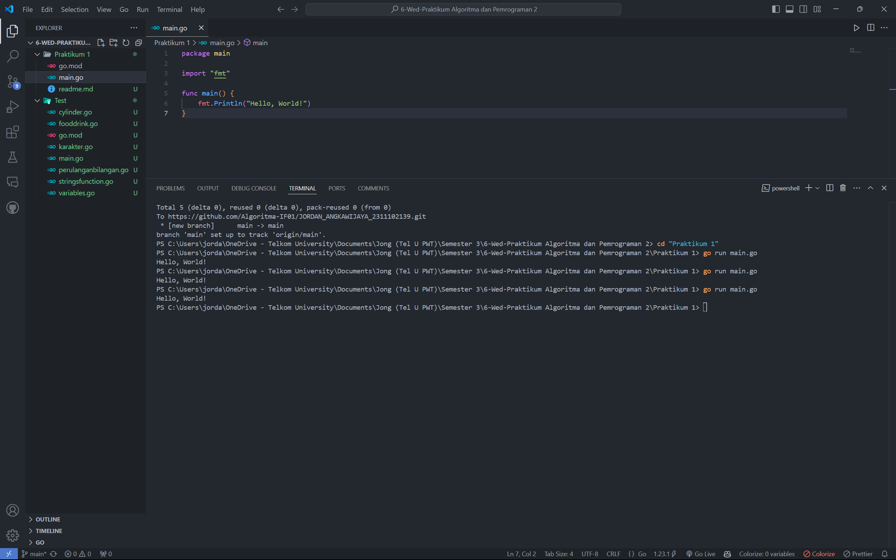

# <h1 align="center">Praktikum 1 Go - Hello World!</h1>
<p align="center">Jordan Angkawijaya - 2311102139</p>

## 1. Program Code "Hello World!"
```go
package main

import "fmt"

func main() {
    fmt.Println("Hello, World!")
}
```

## 2. Screenshot Output
