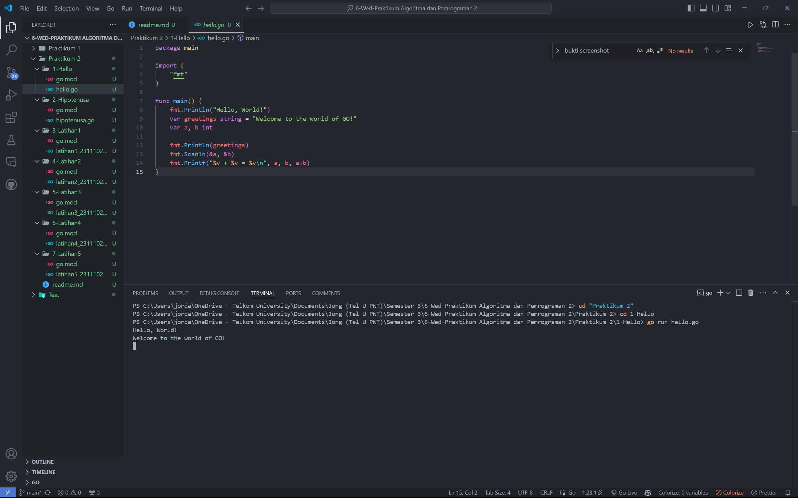
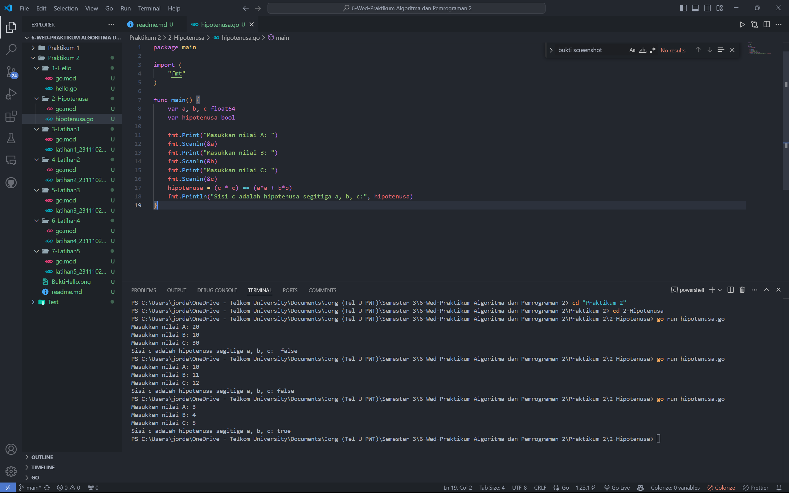
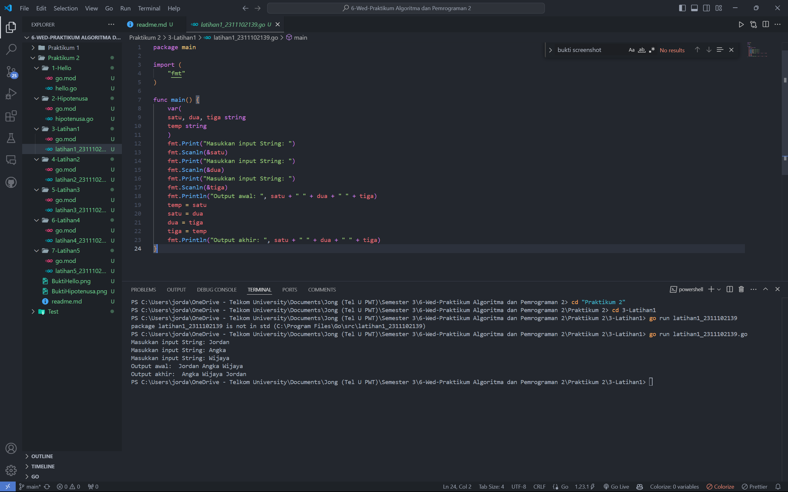
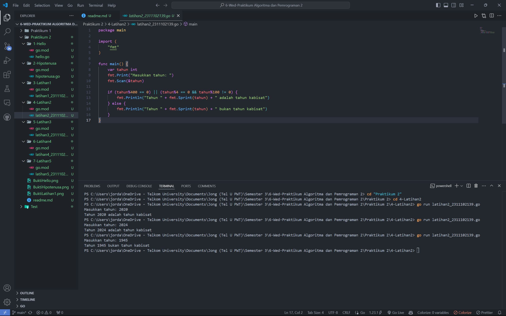
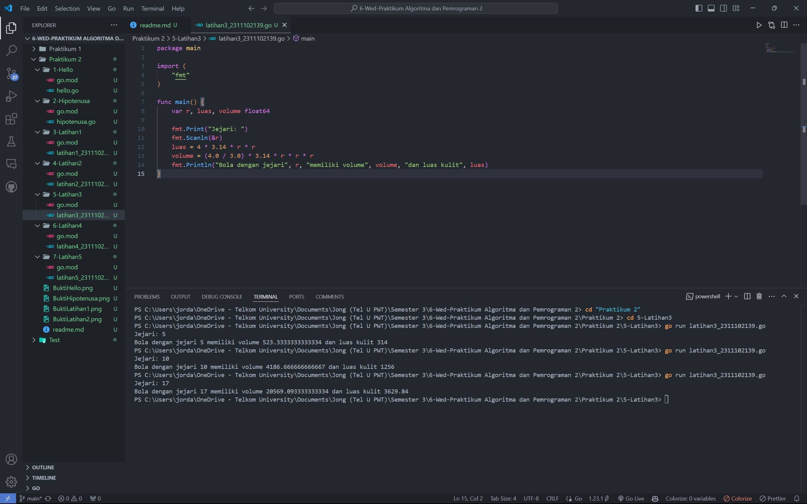
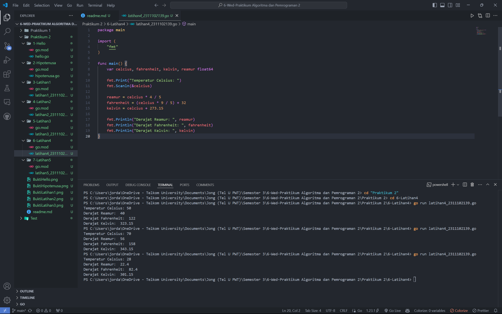
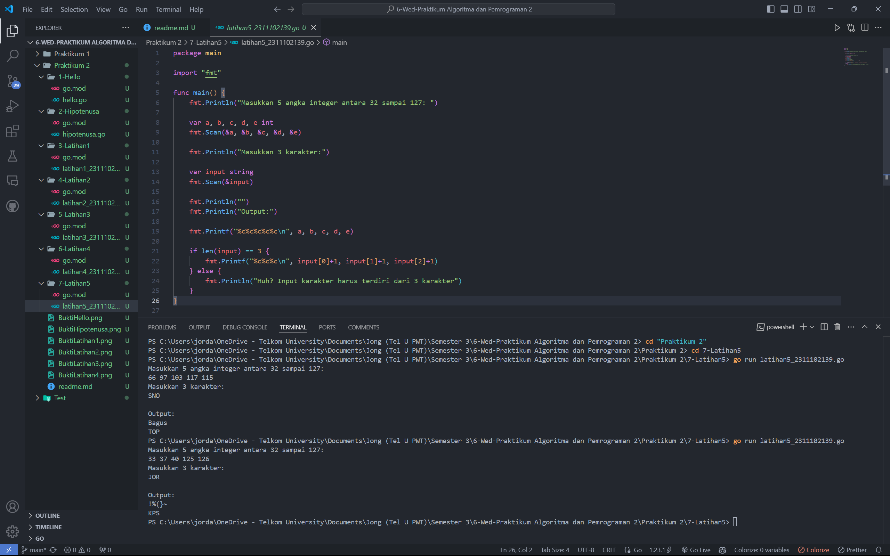

# <h1 align="center">Praktikum 2 Go - Modul 2 Review Struktur Kontrol</h1>
<p align="center">Jordan Angkawijaya - 2311102139</p>

## 1. Program Code "Hello"
```go
package main

import (
	"fmt"
)

func main() {
	fmt.Println("Hello, World!")
	var greetings string = "Welcome to the world of GO!"
	var a, b int

	fmt.Println(greetings)
	fmt.Scanln(&a, &b)
	fmt.Printf("%v + %v = %v\n", a, b, a+b)
}
```
### Screenshot Output


## 2. Program Code "Hipotenusa"
```go
package main

import (
	"fmt"
)

func main() {
	var a, b, c float64
	var hipotenusa bool

	fmt.Print("Masukkan nilai A: ")
	fmt.Scanln(&a)
	fmt.Print("Masukkan nilai B: ")
	fmt.Scanln(&b)
	fmt.Print("Masukkan nilai C: ")
	fmt.Scanln(&c)
	hipotenusa = (c * c) == (a*a + b*b)
	fmt.Println("Sisi c adalah hipotenusa segitiga a, b, c: ", hipotenusa)
}
```
### Screenshot Output


## 3. Program Code Latihan1 - String
```go
package main

import (
	"fmt"
)

func main() {
	var(
	satu, dua, tiga string
	temp string
	)
	fmt.Print("Masukkan input String: ")
	fmt.Scanln(&satu)
	fmt.Print("Masukkan input String: ")
	fmt.Scanln(&dua)
	fmt.Print("Masukkan input String: ")
	fmt.Scanln(&tiga)
	fmt.Println("Output awal: ", satu + " " + dua + " " + tiga)
	temp = satu
	satu = dua
	dua = tiga
	tiga = temp
	fmt.Println("Output akhir: ", satu + " " + dua + " " + tiga)
}
```
### Screenshot Output


## 4. Program Code Latihan2 - Tahun Kabisat
```go
package main

import (
	"fmt"
)

func main() {
	var tahun int
	fmt.Print("Masukkan tahun: ")
	fmt.Scan(&tahun)

	if (tahun%400 == 0) || (tahun%4 == 0 && tahun%100 != 0) {
		fmt.Println("Tahun " + fmt.Sprint(tahun) + " adalah tahun kabisat")
	} else {
		fmt.Println("Tahun " + fmt.Sprint(tahun) + " bukan tahun kabisat")
	}
}
```
### Screenshot Output


## 5. Program Code Latihan3 - Bola
```go
package main

import (
	"fmt"
)

func main() {
	var r, luas, volume float64

	fmt.Print("Jejari: ")
	fmt.Scanln(&r)
	luas = 4 * 3.14 * r * r
	volume = (4.0 / 3.0) * 3.14 * r * r * r
	fmt.Println("Bola dengan jejari", r, "memiliki volume", volume, "dan luas kulit", luas)
}
```
### Screenshot Output


## 6. Program Code Latihan4 - Temperatur
```go
package main

import (
	"fmt"
)

func main() {
	var celcius, fahrenheit, kelvin, reamur float64

	fmt.Print("Temperatur Celsius: ")
	fmt.Scanln(&celcius)

	reamur = celcius * 4 / 5
	fahrenheit = (celcius * 9 / 5) + 32
	kelvin = celcius + 273.15
	
	fmt.Println("Derajat Reamur: ", reamur)
	fmt.Println("Derajat Fahrenheit: ", fahrenheit)
	fmt.Println("Derajat Kelvin: ", kelvin)
}
```
### Screenshot Output


## 7. Program Code Latihan5 - ASCII
```go
package main

import "fmt"

func main() {
	fmt.Println("Masukkan 5 angka integer antara 32 sampai 127: ")

	var a, b, c, d, e int
	fmt.Scan(&a, &b, &c, &d, &e)

	fmt.Println("Masukkan 3 karakter:")
	
	var input string
	fmt.Scan(&input)

	fmt.Println("")
	fmt.Println("Output:")

	fmt.Printf("%c%c%c%c%c\n", a, b, c, d, e)

	if len(input) == 3 {
		fmt.Printf("%c%c%c\n", input[0]+1, input[1]+1, input[2]+1)
	} else {
		fmt.Println("Huh? Input karakter harus terdiri dari 3 karakter")
	}
}
```
### Screenshot Output
