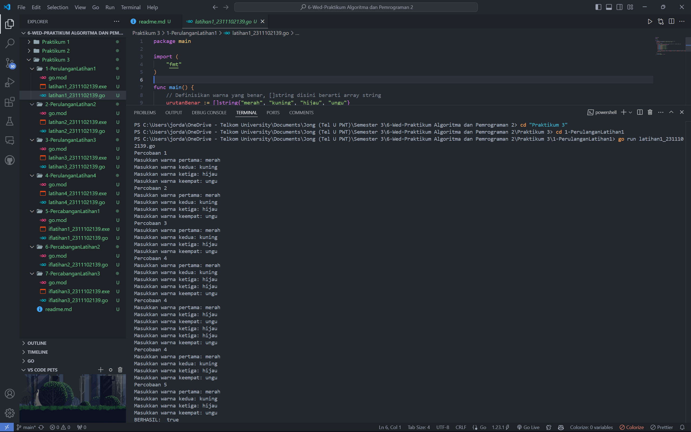
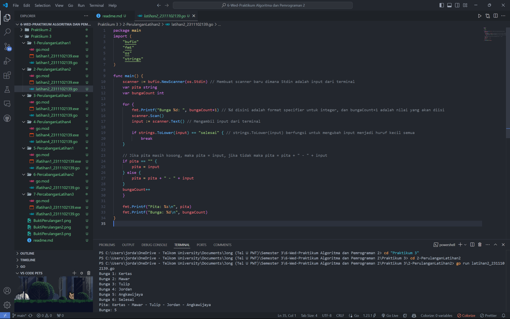
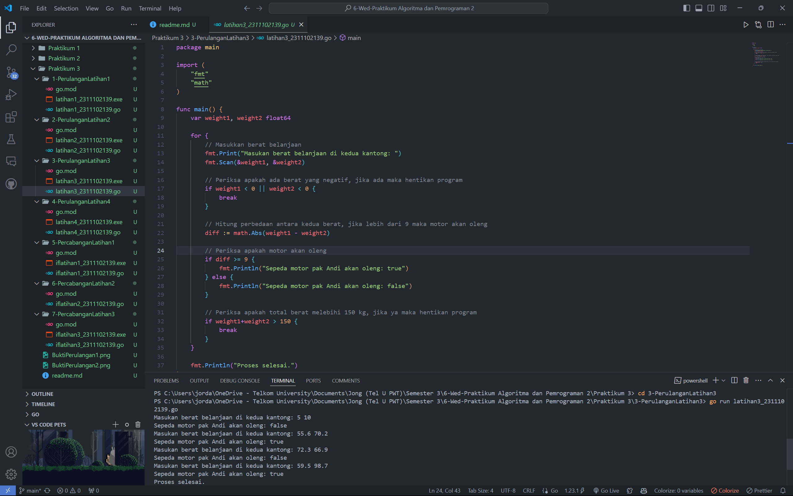
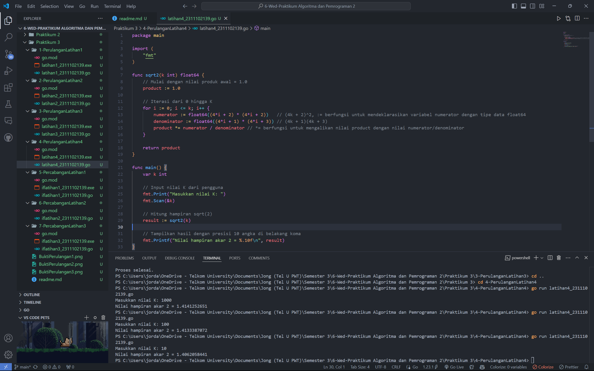
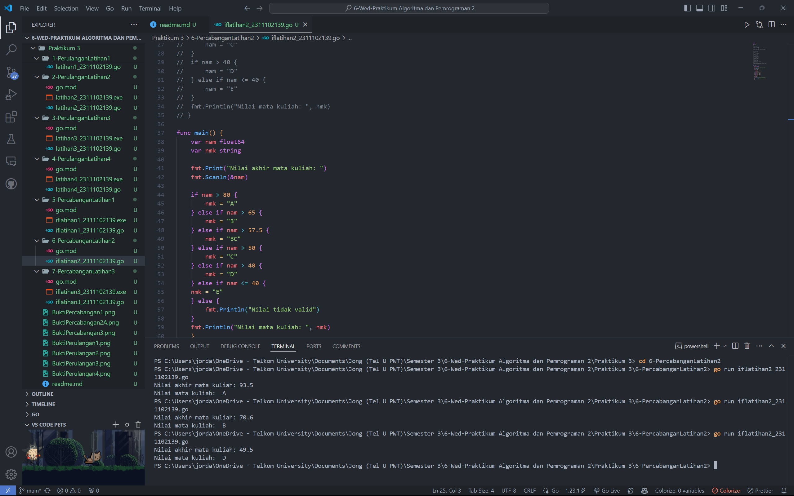
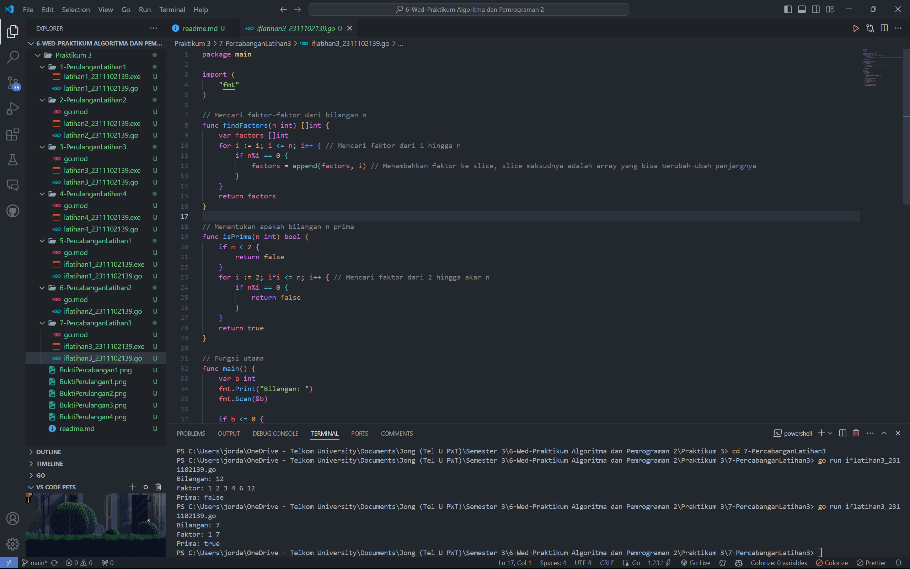

# <h1 align="center">Praktikum 3 Go - Modul 2 Review Struktur Kontrol (Modul 2B & 2C)</h1>
<p align="center">Jordan Angkawijaya - 2311102139</p>

## 1. Program Code Perulangan "Warna Kimia"
```go
package main

import (
	"fmt"
)

func main() {
	// Definisikan warna yang benar, []string disini berarti array string
	urutanBenar := []string{"merah", "kuning", "hijau", "ungu"}
	hasil := true
	
	// Lakukan 5 percobaan
	for i := 1; i <= 5; i++ { // perulangan ini berarti dimulai dari 1 & diulangi hingga 5 kali
		var warna1, warna2, warna3, warna4 string
		fmt.Printf("Percobaan %d\n", i)
		fmt.Print("Masukkan warna pertama: ")
		fmt.Scanln(&warna1)
		fmt.Print("Masukkan warna kedua: ")
		fmt.Scanln(&warna2)
		fmt.Print("Masukkan warna ketiga: ")
		fmt.Scanln(&warna3)
		fmt.Print("Masukkan warna keempat: ")
		fmt.Scanln(&warna4)

		// Periksa apakah urutan warna sesuai, jika warna1 tidak sama dengan urutanBenar[0] yaitu "merah" dst, maka hasil = false
		if warna1 != urutanBenar[0] || warna2 != urutanBenar[1] || warna3 != urutanBenar[2] || warna4 != urutanBenar[3] {
		hasil = false
		}
	}

	// Tampilkan hasil
	fmt.Println("BERHASIL: ", hasil)
}
```
### Screenshot Output


## 2. Program Code Perulangan "Bunga Pita"
```go
package main
import (
	"bufio"
	"fmt"
	"os"
	"strings"
)

func main() {
	scanner := bufio.NewScanner(os.Stdin) // Membuat scanner baru dimana Stdin adalah input dari terminal
	var pita string
	var bungaCount int

	for {
		fmt.Printf("Bunga %d: ", bungaCount+1) // %d disini adalah format specifier untuk integer, dan bungaCount+1 adalah nilai yang akan diisi
		scanner.Scan()
		input := scanner.Text() // Mengambil input dari terminal

		if strings.ToLower(input) == "selesai" { // strings.ToLower(input) berfungsi untuk mengubah input menjadi huruf kecil semua
			break
	}

	// Jika pita masih kosong, maka pita = input, jika tidak maka pita = pita + " - " + input
	if pita == "" {
		pita = input
	} else {
		pita = pita + " - " + input
	}
	bungaCount++
	}

	fmt.Printf("Pita: %s\n", pita)
	fmt.Printf("Bunga: %d\n", bungaCount)
}
```
### Screenshot Output


## 3. Program Code Perulangan Latihan3 - Berat Belanja
```go
package main

import (
	"fmt"
	"math"
)

func main() {
	var weight1, weight2 float64

	for {
		// Masukkan berat belanjaan
		fmt.Print("Masukan berat belanjaan di kedua kantong: ")
		fmt.Scan(&weight1, &weight2)

		// Periksa apakah ada berat yang negatif, jika ada maka hentikan program
		if weight1 < 0 || weight2 < 0 {
			break
		}

		// Hitung perbedaan antara kedua berat, jika lebih dari 9 maka motor akan oleng
		diff := math.Abs(weight1 - weight2)

		// Periksa apakah motor akan oleng
		if diff >= 9 {
			fmt.Println("Sepeda motor pak Andi akan oleng: true")
		} else {
			fmt.Println("Sepeda motor pak Andi akan oleng: false")
		}

		// Periksa apakah total berat melebihi 150 kg, jika ya maka hentikan program
		if weight1+weight2 > 150 {
			break
		}
	}

	fmt.Println("Proses selesai.")
}
```
### Screenshot Output


## 4. Program Code Perulangan Latihan4 - Nilai Akar
```go
package main

import (
	"fmt"
)

func sqrt2(k int) float64 {
	// Mulai dengan nilai produk awal = 1.0
	product := 1.0

	// Iterasi dari 0 hingga K
	for i := 0; i <= k; i++ {
		numerator := float64((4*i + 2) * (4*i + 2))   // (4k + 2)^2, := berfungsi untuk mendeklarasikan variabel numerator dengan tipe data float64
		denominator := float64((4*i + 1) * (4*i + 3)) // (4k + 1)(4k + 3)
		product *= numerator / denominator // *= berfungsi untuk mengalikan nilai product dengan nilai numerator/denominator
	}

	return product
}

func main() {
	var k int

	// Input nilai K dari pengguna
	fmt.Print("Masukkan nilai K: ")
	fmt.Scan(&k)

	// Hitung hampiran sqrt(2)
	result := sqrt2(k)

	// Tampilkan hasil dengan presisi 10 angka di belakang koma
	fmt.Printf("Nilai hampiran akar 2 = %.10f\n", result)
}
```
### Screenshot Output


## 5. Program Code Percabangan Latihan1 - Biaya Pos
```go
package main

import (
	"fmt"
)

func hitungBiaya(berat int) int {
	// Konversi berat dalam gram menjadi kg dan sisa gram
	kg := berat / 1000 // berat dibagi 1000 untuk mendapatkan kg
	sisa := berat % 1000 // % adalah operator modulus, sisa diambil dari pembagian berat dengan 1000

	// Biaya dasar berdasarkan jumlah kg, kg dikali 10000 untuk mendapatkan biaya
	biaya := kg * 10000

	// Jika berat lebih dari 10 kg, sisa gram tidak dikenakan biaya
	if kg >= 10 {
		return biaya
	}

	// Jika sisa >= 500 gram, tambahan biaya Rp. 5,- per gram
	if sisa >= 500 {
		biaya += sisa * 5
	} else {
		// Jika sisa < 500 gram, tambahan biaya Rp. 15,- per gram
		biaya += sisa * 15
	}

	return biaya
}

func main() {
	var berat int

	// Input berat parsel dalam gram
	fmt.Print("Masukkan berat parsel (dalam gram): ")
	fmt.Scan(&berat)

	// Hitung biaya kirim
	totalBiaya := hitungBiaya(berat)

	// Hitung jumlah kg dan sisa gram
	kg := berat / 1000
	sisa := berat % 1000

	// Tampilkan hasil perhitungan
	fmt.Printf("Detail berat: %d kg + %d gr\n", kg, sisa)
	fmt.Printf("Detail biaya: Rp.%d + Rp.%d\n", kg*10000, totalBiaya-(kg*10000))
	fmt.Printf("Total biaya: Rp. %d\n", totalBiaya)
}
```
### Screenshot Output


## 6. Program Code Percabangan Latihan2 - Nilai Matkul
```go
func main() {
	var nam float64
	var nmk string
	
	fmt.Print("Nilai akhir mata kuliah: ")
	fmt.Scanln(&nam)

	if nam > 80 {
		nmk = "A"
	} else if nam > 65 {
		nmk = "B"
	} else if nam > 57.5 {
		nmk = "BC"
	} else if nam > 50 {
		nmk = "C"
	} else if nam > 40 {
		nmk = "D"
	} else if nam <= 40 {
	nmk = "E"
	} else {
		fmt.Println("Nilai tidak valid")
	}
	fmt.Println("Nilai mata kuliah: ", nmk)
}
```
### Jawablah pertanyaan-pertanyaan berikut:
#### a. Jika **nam** diberikan adalah 80.1, apa keluaran dari program tersebut? Apakah eksekusi program tersebut sesuai spesifikasi soal?

<p align="justify">Output dari program tersebut adalah error, tidak dapat dieksekusi, dan tidak sesuai spesifikasi soal. Program tersebut menggunakan variabel "nam" untuk mendeklarasikan predikat nilainya, padahal predikat nilainya bersifat string dan seharusnya menggunakan "nmk" untuk mendeklarasikannya. Oleh karena itu, program tidak dapat dijalani dan perlu diperbaiki.</p>

#### b. Apa saja kesalahan dari program tersebut? Mengapa demikian? Jelaskan alur program seharusnya!
<p align="justify">Kesalahan-kesalahan dari program tersebut ada sebagai berikut:</p>
<p align="justify">1. Penggunaan variabel "nam" untuk pendeklarasian predikat nilai. Seharusnya "nmk".</p>
<p align="justify">2. Salah penggunaan logika if statements. Jika program tersebut hanya menggunakan "if", maka nilai "nam" yang diinput akan mengikuti kondisi "if" terakhir yang dievaluasi dan mengikuti nilai "nmk" kondisi "if" terakhir itu. Misal 80.1 bersifat true saat melewati logika "if" B, BC, C, dan D. Tapi karena kondisi terakhir "if" tersebut adalah D, maka 80.1 tergolongnya D. Seharusnya program ini menggunakan logika "else if" sehingga saat melewati logika pertama yaitu "B" dan bersifat true, maka ia tidak akan mengecek logika lainnya dan akan berhenti di "B".</p>
<p align="justify">Seharusnya program tersebut menggunakan "nmk" untuk mendeklarasikan predikat nilainya & menggunakan logika "else if" untuk percabangan predikat nilainya saat user menginput sebuah nilai "nam".</p>

#### c. Perbaiki program tersebut! Ujilah dengan masukan: 93.5; 70.6; dan 49.5. Seharusnya keluaran yang diperoleh adalah 'A', 'B', dan 'D'.


## 7. Program Code Percabangan Latihan3 - Faktor & Prima
```go
package main

import (
    "fmt"
)

// Mencari faktor-faktor dari bilangan n
func findFactors(n int) []int {
    var factors []int
    for i := 1; i <= n; i++ { // Mencari faktor dari 1 hingga n
        if n%i == 0 {
            factors = append(factors, i) // Menambahkan faktor ke slice, slice maksudnya adalah array yang bisa berubah-ubah panjangnya
        }
    }
    return factors
}

// Menentukan apakah bilangan n prima
func isPrime(n int) bool {
    if n < 2 {
        return false
    }
    for i := 2; i*i <= n; i++ { // Mencari faktor dari 2 hingga akar n
        if n%i == 0 {
            return false
        }
    }
    return true
}

// Fungsi utama
func main() {
    var b int
    fmt.Print("Bilangan: ")
    fmt.Scan(&b)

    if b <= 0 {
        fmt.Println("Bilangan harus lebih dari 0")
        return
    }

    // Mencari faktor-faktor dari b
    fmt.Print("Faktor: ")
    factors := findFactors(b)
    for _, factor := range factors {
        fmt.Print(factor, " ")
    }
    fmt.Println()

    // Menentukan apakah bilangan prima
    isPrime := isPrime(b)
    fmt.Println("Prima:", isPrime)
}
```
### Screenshot Output
