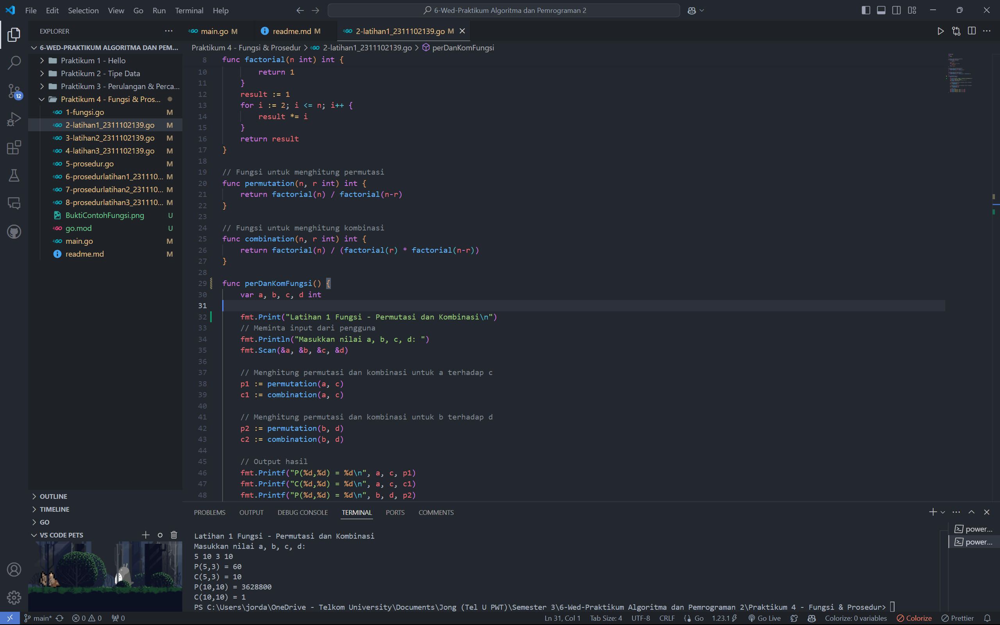

# <h1 align="center">Praktikum 4 Go - Modul 3 Fungsi & Modul 4 Prosedur</h1>
<p align="center">Jordan Angkawijaya - 2311102139</p>

## 1. Contoh Program Fungsi
```go
package main

import (
	"fmt"
)

func fungsi() {
	var a, b int

	fmt.Print("Contoh Fungsi - Permutasi\n")
	fmt.Print("Masukkan nilai a dan b: ")
	fmt.Scan(&a, &b)
	if a >= b {
		fmt.Println(permutasi(a, b))
	} else {
		fmt.Println(permutasi(b, a))
	}
}

func factorialfungsi(n int) int {
	var hasil int = 1
	var i int
	for i = 1; i <= n; i++ {
		hasil = hasil * i
	}
	return hasil
}

func permutasi(n, r int) int {
	return factorialfungsi(n) / factorialfungsi(n-r)
}
```
### Screenshot Output


## 2. Program Code Fungsi Latihan1 - Kombinasi & Permutasi
```go
package main

import (
	"fmt"
)

// Fungsi untuk menghitung faktorial
func factorial(n int) int {
	if n == 0 || n == 1 {
		return 1
	}
	result := 1
	for i := 2; i <= n; i++ {
		result *= i
	}
	return result
}

// Fungsi untuk menghitung permutasi
func permutation(n, r int) int {
	return factorial(n) / factorial(n-r)
}

// Fungsi untuk menghitung kombinasi
func combination(n, r int) int {
	return factorial(n) / (factorial(r) * factorial(n-r))
}

func perDanKomFungsi() {
	var a, b, c, d int

	fmt.Print("Latihan 1 Fungsi - Permutasi dan Kombinasi\n")
	// Meminta input dari pengguna
	fmt.Println("Masukkan nilai a, b, c, d: ")
	fmt.Scan(&a, &b, &c, &d)

	// Menghitung permutasi dan kombinasi untuk a terhadap c
	p1 := permutation(a, c)
	c1 := combination(a, c)

	// Menghitung permutasi dan kombinasi untuk b terhadap d
	p2 := permutation(b, d)
	c2 := combination(b, d)

	// Output hasil
	fmt.Printf("P(%d,%d) = %d\n", a, c, p1)
	fmt.Printf("C(%d,%d) = %d\n", a, c, c1)
	fmt.Printf("P(%d,%d) = %d\n", b, d, p2)
	fmt.Printf("C(%d,%d) = %d\n", b, d, c2)
}
```
### Screenshot Output


## 3. Program Code Fungsi Latihan2 - Matematika
```go
package main

import (
    "fmt"
)

// Fungsi dasar
func f(x int) int {
    return x * x // fungsi ini mengembalikan nilai x pangkat 2
}

func g(x int) int {
    return x - 2 // fungsi ini mengembalikan nilai x dikurangi 2
}

func h(x int) int {
    return x + 1 // fungsi ini mengembalikan nilai x ditambah 1
}

// Fungsi komposisi sesuai instruksi modul
func fogoh(x int) int {
    return f(g(h(x))) // Alasan fogoh bisa menjadi f(g(h(x))) adalah karena h(x), g(x), dan f(x) adalah fungsi yang bisa dijalankan secara berurutan
}

func gohof(x int) int {
    return g(h(f(x))) // Alasan gohof bisa menjadi g(h(f(x))) adalah karena f(x), h(x), dan g(x) adalah fungsi yang bisa dijalankan secara berurutan
}

func hofog(x int) int {
    return h(f(g(x))) // Alasan hofog bisa menjadi h(f(g(x))) adalah karena g(x), f(x), dan h(x) adalah fungsi yang bisa dijalankan secara berurutan
}

func matematika() {
    var a, b, c int

    fmt.Print("Latihan 2 Fungsi - Fungsi Matematika\n")

    fmt.Print("Masukkan nilai a, b, c: ")
    fmt.Scanf("%d %d %d", &a, &b, &c)

    fmt.Println("fogoh(",a,") =", fogoh(a))  // fogoh(a)
    fmt.Println("gohof(",b,") =", gohof(b))  // gohof(b)
    fmt.Println("hofog(",c,") =", hofog(c))  // hofog(c)
}
```
### Screenshot Output


## 4. Program Code Fungsi Latihan3 - Titik Pusat Lingkaran
```go
package main

import (
	"fmt"
	"math"
)

// Fungsi untuk menghitung jarak antara dua titik (a, b) dan (c, d)
func jarak(a, b, c, d float64) float64 {
	return math.Sqrt(math.Pow(a-c, 2) + math.Pow(b-d, 2))
}

// Fungsi untuk memeriksa apakah titik (x, y) berada di dalam lingkaran dengan pusat (cx, cy) dan radius r
func diDalam(cx, cy, r, x, y float64) bool {
	return jarak(cx, cy, x, y) <= r
}

func titikLingkaran() {
	var cx1, cy1, r1 float64 // Lingkaran 1
	var cx2, cy2, r2 float64 // Lingkaran 2
	var x, y float64         // Titik sembarang

	// Input untuk Lingkaran 1
	fmt.Print("Latihan 3 Fungsi - Titik di dalam Lingkaran\n")
	fmt.Print("Masukkan pusat lingkaran 1 dan radius (cx1 cy1 r1): ")
	fmt.Scan(&cx1, &cy1, &r1)

	// Input untuk Lingkaran 2
	fmt.Print("Masukkan pusat lingkaran 2 dan radius (cx2 cy2 r2): ")
	fmt.Scan(&cx2, &cy2, &r2)

	// Input untuk Titik sembarang
	fmt.Print("Masukkan titik sembarang (x y): ")
	fmt.Scan(&x, &y)

	// Cek apakah titik berada di dalam lingkaran 1 dan/atau lingkaran 2
	dalamLingkaran1 := diDalam(cx1, cy1, r1, x, y) // titik berada di dalam lingkaran 1 jika jarak titik ke pusat lingkaran 1 <= radius lingkaran 1, := berfungsi untuk mendeklarasikan variabel dalamLingkaran1
	dalamLingkaran2 := diDalam(cx2, cy2, r2, x, y) // titik berada di dalam lingkaran 2 jika jarak titik ke pusat lingkaran 2 <= radius lingkaran 2

	// Tentukan keluaran berdasarkan posisi titik
	if dalamLingkaran1 && dalamLingkaran2 {
		fmt.Println("Titik di dalam lingkaran 1 dan 2.")
	} else if dalamLingkaran1 {
		fmt.Println("Titik di dalam lingkaran 1.")
	} else if dalamLingkaran2 {
		fmt.Println("Titik di dalam lingkaran 2.")
	} else {
		fmt.Println("Titik di luar lingkaran 1 dan 2.")
	}
}
```
### Screenshot Output


## 5. Contoh Program Prosedur
```go
package main

import (
	"fmt"
)

// Fungsi rekursif untuk menghitung deret Fibonacci
func fibonacci(n int) int {
	if n == 0 {
		return 0
	} else if n == 1 {
		return 1
	} else {
		return fibonacci(n-1) + fibonacci(n-2)
	}
}

func prosedur() {
	// Menampilkan deret Fibonacci hingga suku ke-10
	fmt.Println("Contoh Prosedur - Deret Fibonacci")
	fmt.Println("Deret Fibonacci hingga suku ke-10: ")
	for i := 0; i <= 10; i++ {
		fmt.Printf("Fibonacci(%d) = %d\n", i, fibonacci(i))
	}
}
```
### Screenshot Output


## 6. Program Code Prosedur Latihan1 - Kombinasi & Permutasi
```go
package main

import (
	"fmt"
)

// Fungsi untuk menghitung faktorial
func prosedurFactorial(n int) int {
	if n == 0 || n == 1 {
		return 1
	}
	result := 1
	for i := 2; i <= n; i++ {
		result *= i
	}
	return result
}

// Fungsi untuk menghitung permutasi
func prosedurPermutation(n, r int) int {
	return prosedurFactorial(n) / prosedurFactorial(n-r)
}

// Fungsi untuk menghitung kombinasi
func prosedurCombination(n, r int) int {
	return prosedurFactorial(n) / (prosedurFactorial(r) * prosedurFactorial(n-r))
}

func perDanKomProsedur() {
	var a, b, c, d int

	fmt.Print("Latihan 1 Prosedur - Permutasi dan Kombinasi\n")
	// Meminta input dari pengguna
	fmt.Println("Masukkan nilai a, b, c, d: ")
	fmt.Scan(&a, &b, &c, &d)

	// Menghitung permutasi dan kombinasi untuk a terhadap c
	p1 := prosedurPermutation(a, c)
	c1 := prosedurCombination(a, c)

	// Menghitung permutasi dan kombinasi untuk b terhadap d
	p2 := prosedurPermutation(b, d)
	c2 := prosedurCombination(b, d)

	// Output hasil
	fmt.Printf("P(%d,%d) = %d\n", a, c, p1)
	fmt.Printf("C(%d,%d) = %d\n", a, c, c1)
	fmt.Printf("P(%d,%d) = %d\n", b, d, p2)
	fmt.Printf("C(%d,%d) = %d\n", b, d, c2)
}
```
### Screenshot Output


## 7. Program Code Prosedur Latihan2 - Waktu Soal
```go
package main

import (
	"bufio"
	"fmt"
	"os"
	"strconv" // Package strconv berisi fungsi-fungsi untuk mengkonversi tipe data
	"strings" // Package strings berisi fungsi-fungsi untuk memanipulasi string
)

// hitungSkor menghitung jumlah soal yang diselesaikan (<= 300 menit) dan total waktu untuk soal yang diselesaikan.
func hitungSkor(soal []int, jumlahSoal *int, totalWaktu *int) { //[]int berarti array integer, dimana jumlah elemennya tidak ditentukan & *int berarti pointer ke integer
	*jumlahSoal = 0
	*totalWaktu = 0
	for _, waktu := range soal {
		// Hanya menghitung waktu soal yang diselesaikan dalam <= 300 menit
		if waktu <= 300 {
			*jumlahSoal++        // Tambah jumlah soal yang berhasil diselesaikan
			*totalWaktu += waktu // Tambah waktu ke total waktu
		}
	}
}

// soalWaktu memproses input, menghitung skor tiap peserta, dan menentukan pemenang.
func soalWaktu() {
	scanner := bufio.NewScanner(os.Stdin)

	fmt.Print("Latihan 2 Prosedur - Soal dan Waktu\n")
	// Deskripsi untuk input dari pengguna
	fmt.Println("Masukkan data peserta (format: Nama Soal1 Soal2 ... Soal8), ketik 'Selesai' untuk mengakhiri input:")

	pemenang, maxSoal, minWaktu := "", -1, 99999 // Inisialisasi variabel pemenang, -1 berasal dari jumlah soal yang diselesaikan, 99999 berasal dari total waktu

	// Memproses input hingga "Selesai" dimasukkan
	for scanner.Scan() {
		line := scanner.Text()
		if strings.ToLower(line) == "selesai" { // Memeriksa apakah pengguna mengetik 'Selesai' atau 'selesai'
			break // Keluar dari loop jika pengguna mengetik 'Selesai'
		}
		data := strings.Fields(line)  // Memisahkan baris input menjadi bagian-bagian (nama dan waktu)
		nama := data[0]               // Nama peserta
		soal := make([]int, 8)        // Array untuk menyimpan waktu pengerjaan 8 soal
		for i := 0; i < 8; i++ {      // Loop untuk mengonversi waktu soal ke integer
			soal[i], _ = strconv.Atoi(data[i+1]) // Konversi waktu soal ke integer, dan Atoi adalah fungsi untuk mengonversi string ke integer
		}
		var jumlahSoal, totalWaktu int
		hitungSkor(soal, &jumlahSoal, &totalWaktu) // Menghitung skor peserta

		// Menentukan pemenang berdasarkan jumlah soal yang diselesaikan dan total waktu
		if jumlahSoal > maxSoal || (jumlahSoal == maxSoal && totalWaktu < minWaktu) {
			pemenang, maxSoal, minWaktu = nama, jumlahSoal, totalWaktu // Jika jumlah soal yang diselesaikan lebih besar dari maxSoal atau jumlah soal yang 
			// diselesaikan sama dengan maxSoal dan total waktu lebih kecil dari minWaktu, maka pemenang, maxSoal, dan minWaktu diupdate
		}
	}

	// Output pemenang dan skornya
	fmt.Println("\n-=- Hasil Kompetisi -=-")
	fmt.Printf("Pemenang: %s\nJumlah soal yang diselesaikan: %d soal!\nTotal waktu: %d menit!\n", pemenang, maxSoal, minWaktu)
}
```
### Screenshot Output


## 8. Program Code Prosedur Latihan3 - Deret Bilangan
```go
package main

import (
	"fmt"
)

// cetakDeret mencetak setiap suku dari deret yang dimulai dari nilai awal n
func cetakDeret(n int) {
	for n != 1 {
		fmt.Printf("%d ", n) // Cetak suku saat ini diikuti oleh spasi
		if n%2 == 0 {
			n /= 2 // Jika genap, bagi dua
		} else {
			n = 3*n + 1 // Jika ganjil, kalikan tiga lalu tambah satu
		}
	}
	fmt.Println(1) // Cetak 1 sebagai akhir deret dan memberhentikan rekursi
}

func deretBilangan() {
	// Input: Suku awal (bilangan positif kurang dari 1000000)
	var n int
	fmt.Println("Latihan 3 Prosedur - Deret Bilangan")
	fmt.Println("Masukkan nilai suku awal (bilangan positif < 1000000):")
	fmt.Scan(&n)

	// Validasi input
	if n <= 0 || n >= 1000000 {
		fmt.Println("Masukan tidak valid, masukkan bilangan positif kurang dari 1000000.")
		return
	}

	// Panggil prosedur cetakDeret
	cetakDeret(n)
}
```
### Screenshot Output
