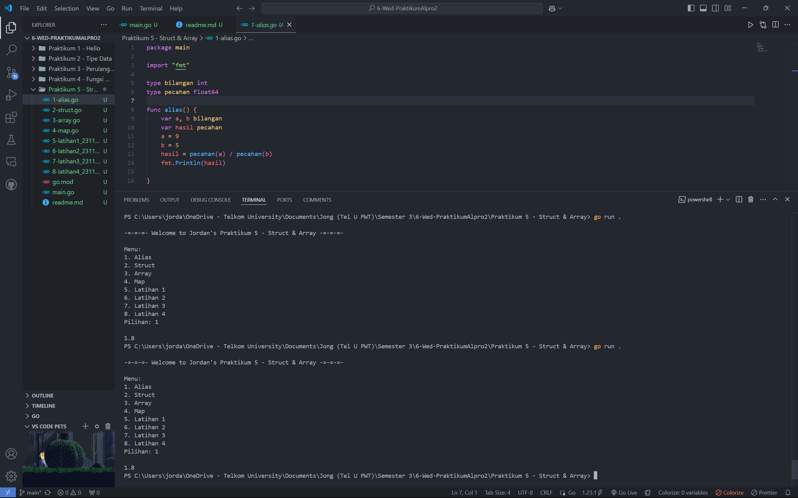
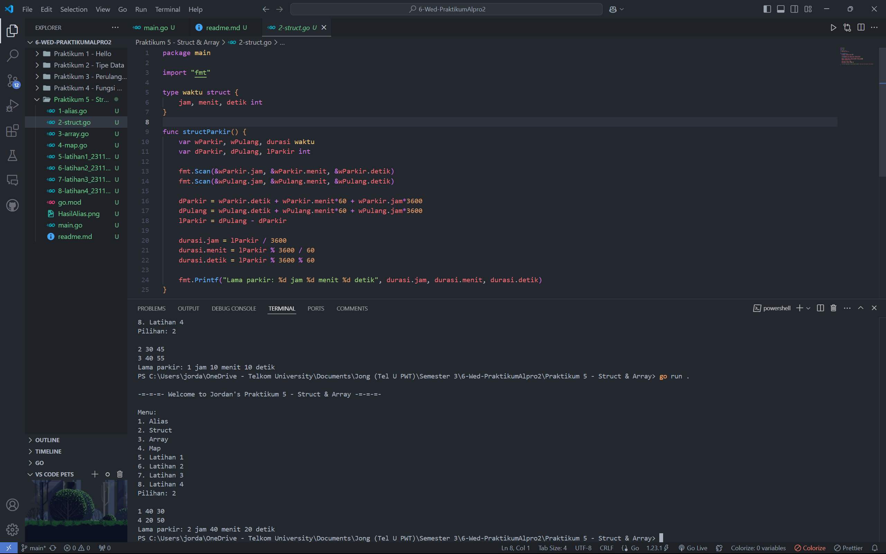
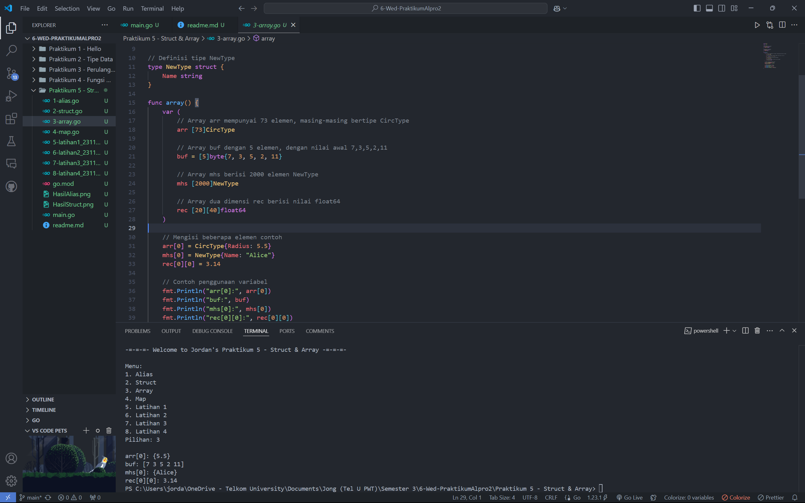
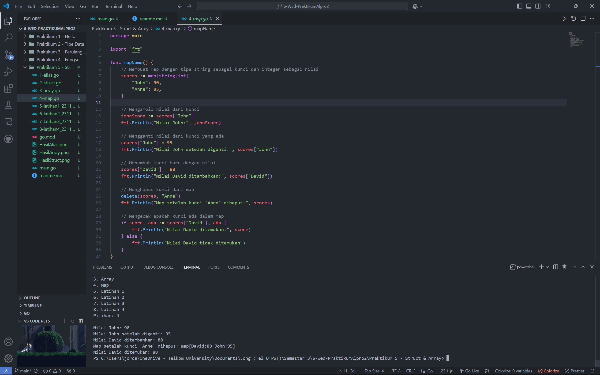
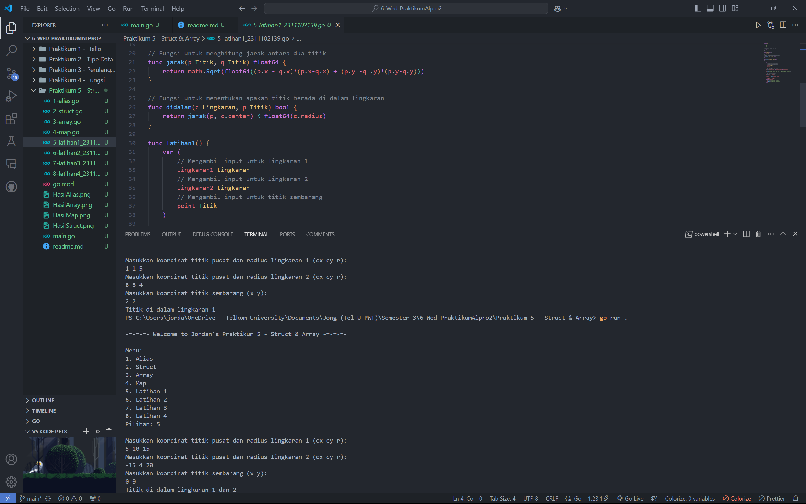
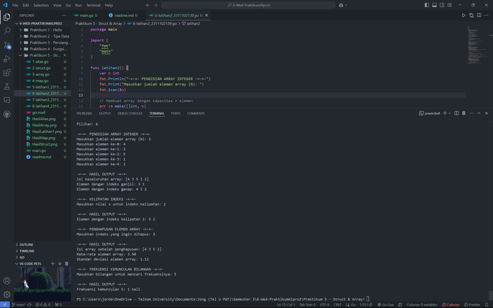
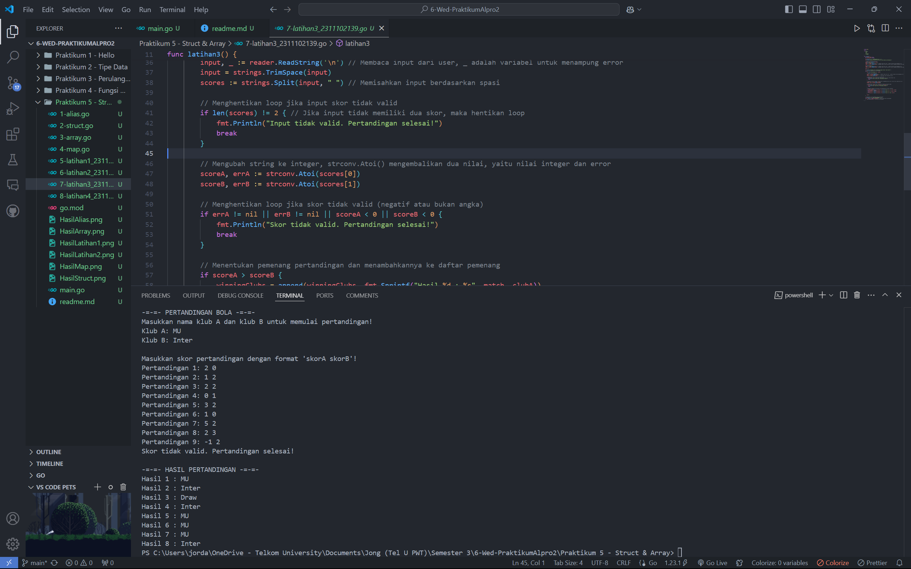
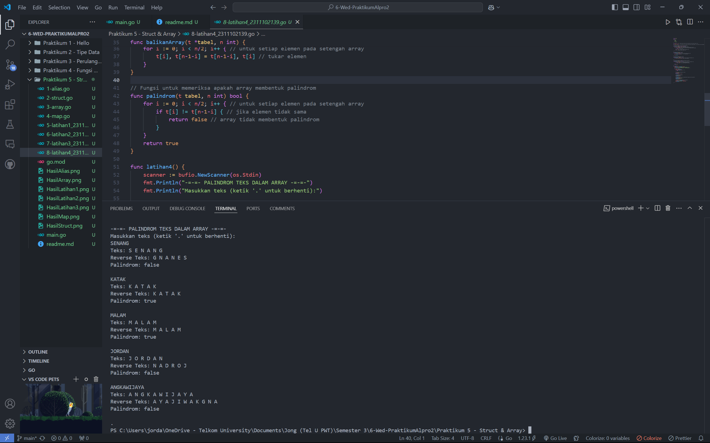

# <h1 align="center">Praktikum 5 Go - Modul 7 Struct & Array</h1>
<p align="center">Jordan Angkawijaya - 2311102139</p>

## 1. Contoh Program Alias
```go
package main

import "fmt"

type bilangan int
type pecahan float64

func alias() {
	var a, b bilangan
	var hasil pecahan
	a = 9
	b = 5
	hasil = pecahan(a) / pecahan(b)
	fmt.Println(hasil)

}
```
### Screenshot Output


## 2. Contoh Program Struct
```go
package main

import "fmt"

type waktu struct {
	jam, menit, detik int
}

func structParkir() {
	var wParkir, wPulang, durasi waktu
	var dParkir, dPulang, lParkir int

	fmt.Scan(&wParkir.jam, &wParkir.menit, &wParkir.detik)
	fmt.Scan(&wPulang.jam, &wPulang.menit, &wPulang.detik)

	dParkir = wParkir.detik + wParkir.menit*60 + wParkir.jam*3600
	dPulang = wPulang.detik + wPulang.menit*60 + wPulang.jam*3600
	lParkir = dPulang - dParkir

	durasi.jam = lParkir / 3600
	durasi.menit = lParkir % 3600 / 60
	durasi.detik = lParkir % 3600 % 60
	
	fmt.Printf("Lama parkir: %d jam %d menit %d detik", durasi.jam, durasi.menit, durasi.detik)
}
```
### Screenshot Output


## 3. Contoh Program Array
```go
package main

import "fmt"

// Definisi tipe CircType
type CircType struct {
	Radius float64
}

// Definisi tipe NewType
type NewType struct {
	Name string
}

func array() {
	var (
		// Array arr mempunyai 73 elemen, masing-masing bertipe CircType
		arr [73]CircType

		// Array buf dengan 5 elemen, dengan nilai awal 7,3,5,2,11
		buf = [5]byte{7, 3, 5, 2, 11}

		// Array mhs berisi 2000 elemen NewType
		mhs [2000]NewType

		// Array dua dimensi rec berisi nilai float64
		rec [20][40]float64
	)

	// Mengisi beberapa elemen contoh
	arr[0] = CircType{Radius: 5.5}
	mhs[0] = NewType{Name: "Alice"}
	rec[0][0] = 3.14

	// Contoh penggunaan variabel
	fmt.Println("arr[0]:", arr[0])
	fmt.Println("buf:", buf)
	fmt.Println("mhs[0]:", mhs[0])
	fmt.Println("rec[0][0]:", rec[0][0])
}
```
### Screenshot Output


## 4. Contoh Program Map
```go
package main

import "fmt"

func mapName() {
	// Membuat map dengan tipe string sebagai kunci dan integer sebagai nilai
	scores := map[string]int{
		"John": 90,
		"Anne": 85,
	}

	// Mengambil nilai dari kunci
	johnScore := scores["John"]
	fmt.Println("Nilai John:", johnScore)

	// Mengganti nilai dari kunci yang ada
	scores["John"] = 95
	fmt.Println("Nilai John setelah diganti:", scores["John"])

	// Menambah kunci baru dengan nilai
	scores["David"] = 88
	fmt.Println("Nilai David ditambahkan:", scores["David"])

	// Menghapus kunci dari map
	delete(scores, "Anne")
	fmt.Println("Map setelah kunci 'Anne' dihapus:", scores)

	// Mengecek apakah kunci ada dalam map
	if score, ada := scores["David"]; ada {
		fmt.Println("Nilai David ditemukan:", score)
	} else {
		fmt.Println("Nilai David tidak ditemukan")
	}
}
```
### Screenshot Output


## 5. Program Code Latihan1 - Titik Pusat Lingkaran
```go
package main

import (
	"fmt"
	"math"
)

// Definisi tipe bentukan untuk titik
type Titik struct {
	x int
	y int
}

// Definisi tipe bentukan untuk lingkaran
type Lingkaran struct {
	center Titik
	radius int
}

// Fungsi untuk menghitung jarak antara dua titik
func jarak(p Titik, q Titik) float64 {
	return math.Sqrt(float64((p.x - q.x)*(p.x-q.x) + (p.y -q .y)*(p.y-q.y)))
}

// Fungsi untuk menentukan apakah titik berada di dalam lingkaran
func didalam(c Lingkaran, p Titik) bool {
	return jarak(p, c.center) < float64(c.radius)
}

func latihan1() {
	var (
		// Mengambil input untuk lingkaran 1
		lingkaran1 Lingkaran
		// Mengambil input untuk lingkaran 2
		lingkaran2 Lingkaran
		// Mengambil input untuk titik sembarang
		point Titik
	)

	// Input untuk lingkaran 1 (cx, cy, r)
	fmt.Println("Masukkan koordinat titik pusat dan radius lingkaran 1 (cx cy r):")
	fmt.Scan(&lingkaran1.center.x, &lingkaran1.center.y, &lingkaran1.radius)

	// Input untuk lingkaran 2 (cx, cy, r)
	fmt.Println("Masukkan koordinat titik pusat dan radius lingkaran 2 (cx cy r):")
	fmt.Scan(&lingkaran2.center.x, &lingkaran2.center.y, &lingkaran2.radius)

	// Input untuk titik sembarang (x, y)
	fmt.Println("Masukkan koordinat titik sembarang (x y):")
	fmt.Scan(&point.x, &point.y)

	// Mengecek posisi titik terhadap kedua lingkaran
	inLingkaran1 := didalam(lingkaran1, point)
	inLingkaran2 := didalam(lingkaran2, point)

	if inLingkaran1 && inLingkaran2 {
		fmt.Println("Titik di dalam lingkaran 1 dan 2")
	} else if inLingkaran1 {
		fmt.Println("Titik di dalam lingkaran 1")
	} else if inLingkaran2 {
		fmt.Println("Titik di dalam lingkaran 2")
	} else {
		fmt.Println("Titik di luar lingkaran 1 dan 2")
	}
}
```
### Screenshot Output


## 6. Program Code Latihan2 - Array Bilangan Bulat
```go
package main

import (
	"fmt"
	"math"
)

func latihan2() {
	var n int
	fmt.Println("-=-=- PENGISIAN ARRAY INTEGER -=-=-")
	fmt.Print("Masukkan jumlah elemen array (N): ")
	fmt.Scan(&n)

	// Membuat array dengan kapasitas n elemen
	arr := make([]int, n)
	for i := 0; i < n; i++ {
		fmt.Printf("Masukkan elemen ke-%d: ", i)
		fmt.Scan(&arr[i])
	}

	// a. Menampilkan keseluruhan isi dari array
	fmt.Println("\n-=-=- HASIL OUTPUT -=-=-")
	fmt.Println("Isi keseluruhan array:", arr)

	// b. Menampilkan elemen-elemen array dengan indeks ganjil saja
	fmt.Print("Elemen dengan indeks ganjil: ")
	for i := 1; i < len(arr); i += 2 {
		fmt.Print(arr[i], " ")
	}
	fmt.Println()

	// c. Menampilkan elemen-elemen array dengan indeks genap saja
	fmt.Print("Elemen dengan indeks genap: ")
	for i := 0; i < len(arr); i += 2 {
		fmt.Print(arr[i], " ")
	}
	fmt.Println()

	// d. Menampilkan elemen-elemen array dengan indeks kelipatan bilangan x
	var x int
	fmt.Print("\n")
	fmt.Println("-=-=- KELIPATAN INDEKS -=-=-")
	fmt.Print("Masukkan nilai x untuk indeks kelipatan: ")
	fmt.Scan(&x)
	fmt.Println("\n-=-=- HASIL OUTPUT -=-=-")
	fmt.Printf("Elemen dengan indeks kelipatan %d: ", x)
	for i := x; i < len(arr); i += x {
		fmt.Print(arr[i], " ")
	}
	fmt.Println()

	// e. Menghapus elemen array pada indeks tertentu
	var delIdx int
	fmt.Print("\n")
	fmt.Println("-=-=- PENGHAPUSAN ELEMEN ARRAY -=-=-")
	fmt.Print("Masukkan indeks yang ingin dihapus: ")
	fmt.Scan(&delIdx)
	fmt.Println("\n-=-=- HASIL OUTPUT -=-=-")
	if delIdx >= 0 && delIdx < len(arr) {
		arr = append(arr[:delIdx], arr[delIdx+1:]...) // Menghapus elemen array pada indeks tertentu
		fmt.Println("Isi array setelah penghapusan:", arr)
	} else {
		fmt.Println("Indeks tidak valid, where!?")
	}

	// f. Menampilkan rata-rata dari bilangan yang ada di dalam array
	var sum int
	for _, val := range arr {
		sum += val
	}
	average := float64(sum) / float64(len(arr)) // len(arr) adalah panjang array
	fmt.Printf("Rata-rata elemen array: %.2f\n", average)

	// g. Menampilkan standar deviasi atau simpangan baku dari bilangan yang ada di dalam array
	var varianceSum float64
	for _, val := range arr { // Menghitung varians
		varianceSum += math.Pow(float64(val)-average, 2) // (x - rata-rata)^2
	}
	standardDeviation := math.Sqrt(varianceSum / float64(len(arr))) // Standar deviasi = akar dari varians
	fmt.Printf("Standar deviasi elemen array: %.2f\n", standardDeviation)

	// h. Menampilkan frekuensi dari suatu bilangan tertentu
	var target int
	fmt.Print("\n")
	fmt.Println("-=-=- FREKUENSI KEMUNCULAN BILANGAN -=-=-")
	fmt.Print("Masukkan bilangan untuk mencari frekuensinya: ")
	fmt.Scan(&target)
	frequency := 0 // Inisialisasi frekuensi adalah 0
	for _, val := range arr { // untuk setiap elemen array
		if val == target { // jika elemen array sama dengan target
			frequency++ // tambahkan frekuensi
		}
	}
	fmt.Println("\n-=-=- HASIL OUTPUT -=-=-")
	fmt.Printf("Frekuensi kemunculan %d: %d kali\n", target, frequency)
	fmt.Print("\n")
}
```
### Screenshot Output


## 7. Program Code Latihan3 - Pertandingan Bola
```go
package main

import (
	"bufio"
	"fmt"
	"os"
	"strconv"
	"strings"
)

func latihan3() {
	var clubA, clubB string
	var winningClubs []string

	fmt.Println("\n-=-=- PERTANDINGAN BOLA -=-=-")
	fmt.Println("Masukkan nama klub A dan klub B untuk memulai pertandingan!")

	// Membaca nama klub A dan klub B
	reader := bufio.NewReader(os.Stdin)
	fmt.Print("Klub A: ")
	clubA, _ = reader.ReadString('\n') // Membaca input dari user, _ adalah variabel untuk menampung error
	clubA = strings.TrimSpace(clubA) // Menghapus spasi di awal dan akhir string, TrimSpace berfungsi untuk menghapus spasi di awal dan akhir string

	fmt.Print("Klub B: ")
	clubB, _ = reader.ReadString('\n') // Membaca input dari user, _ adalah variabel untuk menampung error
	clubB = strings.TrimSpace(clubB) // Menghapus spasi di awal dan akhir string, TrimSpace berfungsi untuk menghapus spasi di awal dan akhir string

	match := 1

	fmt.Println("\nMasukkan skor pertandingan dengan format 'skorA skorB'!")
	// Loop untuk memasukkan skor pertandingan
	for {
		fmt.Printf("Pertandingan %d: ", match)

		// Membaca skor pertandingan
		input, _ := reader.ReadString('\n') // Membaca input dari user, _ adalah variabel untuk menampung error
		input = strings.TrimSpace(input)
		scores := strings.Split(input, " ") // Memisahkan input berdasarkan spasi

		// Menghentikan loop jika input skor tidak valid
		if len(scores) != 2 { // Jika input tidak memiliki dua skor, maka hentikan loop
			fmt.Println("Input tidak valid. Pertandingan selesai!")
			break
		}

		// Mengubah string ke integer, strconv.Atoi() mengembalikan dua nilai, yaitu nilai integer dan error
		scoreA, errA := strconv.Atoi(scores[0]) 
		scoreB, errB := strconv.Atoi(scores[1]) 

		// Menghentikan loop jika skor tidak valid (negatif atau bukan angka)
		if errA != nil || errB != nil || scoreA < 0 || scoreB < 0 {
			fmt.Println("Skor tidak valid. Pertandingan selesai!")
			break
		}

		// Menentukan pemenang pertandingan dan menambahkannya ke daftar pemenang
		if scoreA > scoreB {
			winningClubs = append(winningClubs, fmt.Sprintf("Hasil %d : %s", match, clubA))
		} else if scoreA < scoreB {
			winningClubs = append(winningClubs, fmt.Sprintf("Hasil %d : %s", match, clubB))
		} else {
			winningClubs = append(winningClubs, fmt.Sprintf("Hasil %d : Draw", match))
		}

		match++
	}

	// Menampilkan review pemenang setiap pertandingan
	fmt.Println("\n-=-=- HASIL PERTANDINGAN -=-=-")
	for _, result := range winningClubs { // Untuk setiap hasil pertandingan,
		fmt.Println(result) // cetak hasil pertandingan
	}
}
```
### Screenshot Output


## 8. Program Code Latihan4 - Array Palindrom
```go
package main

import (
	"bufio"
	"fmt"
	"os"
	"strings"
)

const NMAX int = 127 // NMAX adalah konstanta yang menyatakan batas maksimum elemen array

type tabel [NMAX]rune // tabel adalah array karakter dengan batas maksimum NMAX, rune berfungsi untuk menyimpan karakter unicode, unicode adalah standar internasional untuk encoding karakter

// Fungsi untuk mengisi array dari input satu baris
func isiArray(t *tabel, n *int, line string) {
	*n = 0 // inisialisasi jumlah elemen array, yaitu 0
	for _, char := range line { // untuk setiap karakter pada baris input
		if *n >= NMAX { // jika jumlah elemen array sudah mencapai batas maksimum
			break // hentikan loop
		}
		t[*n] = char // masukkan karakter ke dalam array
		*n++ // tambahkan jumlah elemen array
	}
}

// Fungsi untuk mencetak isi array
func cetakArray(t tabel, n int) {
	for i := 0; i < n; i++ { // untuk setiap elemen pada array
		fmt.Print(string(t[i]), " ") // cetak elemen
	}
	fmt.Println()
}

// Fungsi untuk membalikkan isi array
func balikanArray(t *tabel, n int) {
	for i := 0; i < n/2; i++ { // untuk setiap elemen pada setengah array
		t[i], t[n-1-i] = t[n-1-i], t[i] // tukar elemen
	}
}

// Fungsi untuk memeriksa apakah array membentuk palindrom
func palindrom(t tabel, n int) bool {
	for i := 0; i < n/2; i++ { // untuk setiap elemen pada setengah array
		if t[i] != t[n-1-i] { // jika elemen tidak sama
			return false // array tidak membentuk palindrom
		}
	}
	return true
}

func latihan4() {
	scanner := bufio.NewScanner(os.Stdin)
	fmt.Println("-=-=- PALINDROM TEKS DALAM ARRAY -=-=-")
	fmt.Println("Masukkan teks (ketik '.' untuk berhenti):")

	for scanner.Scan() {
		line := scanner.Text()
		if strings.ToUpper(line) == "." {
			break
		}

		// Mengisi array dengan baris input
		var tab tabel
		var m int
		isiArray(&tab, &m, line)

		// Menampilkan array asli
		fmt.Print("Teks: ")
		cetakArray(tab, m)

		// Membalikkan isi array dan menampilkannya sebagai teks yang dibalik
		balikanArray(&tab, m)
		fmt.Print("Reverse Teks: ")
		cetakArray(tab, m)
		
		// Mengecek dan menampilkan hasil palindrom
		isPalindrom := palindrom(tab, m)
		fmt.Println("Palindrom:", isPalindrom)
		fmt.Println()
	}
}
```
### Screenshot Output
