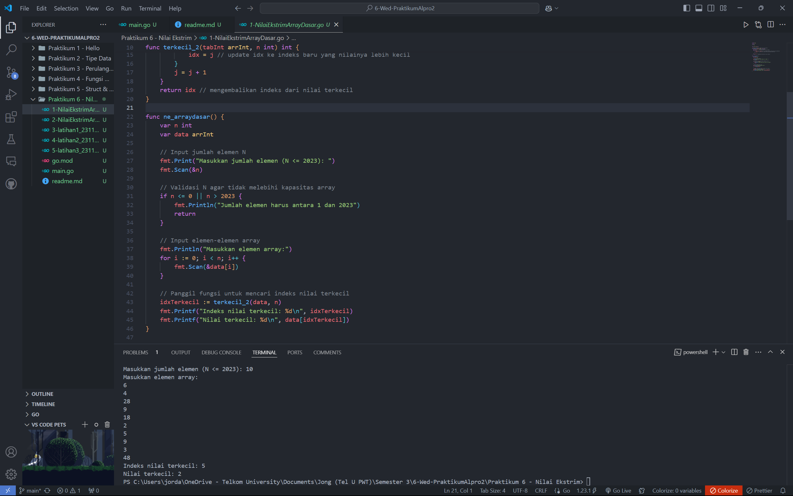
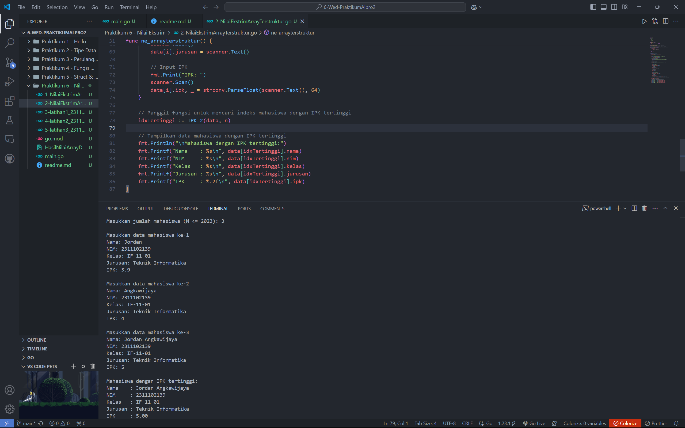
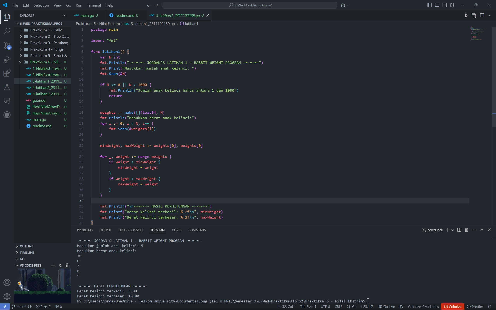
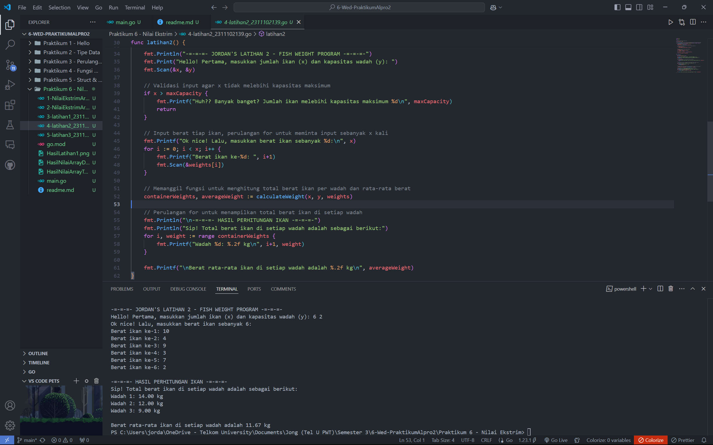
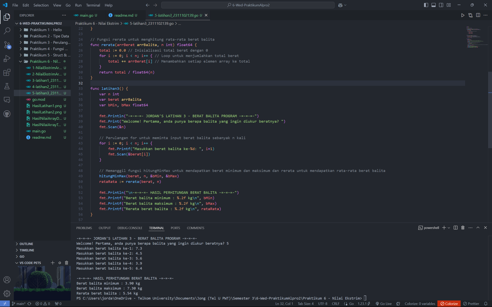

# <h1 align="center">Praktikum 6 Go - Modul 10 Nilai Ekstrim</h1>
<p align="center">Jordan Angkawijaya - 2311102139</p>

## 1. Contoh Program Nilai Ekstrim pada Array Dasar
```go
package main

import (
	"fmt"
)

type arrInt [2023]int

// Fungsi untuk mencari indeks dari nilai terkecil
func terkecil_2(tabInt arrInt, n int) int {
	var idx int = 0 // indeks data pertama
	var j int = 1   // pencarian dimulai dari data kedua
	for j < n {
		if tabInt[idx] > tabInt[j] { // cek apakah tabInt[j] lebih kecil dari tabInt[idx]
			idx = j // update idx ke indeks baru yang nilainya lebih kecil
		}
		j = j + 1
	}
	return idx // mengembalikan indeks dari nilai terkecil
}

func ne_arraydasar() {
	var n int
	var data arrInt

	// Input jumlah elemen N
	fmt.Print("Masukkan jumlah elemen (N <= 2023): ")
	fmt.Scan(&n)

	// Validasi N agar tidak melebihi kapasitas array
	if n <= 0 || n > 2023 {
		fmt.Println("Jumlah elemen harus antara 1 dan 2023")
		return
	}

	// Input elemen-elemen array
	fmt.Println("Masukkan elemen array:")
	for i := 0; i < n; i++ {
		fmt.Scan(&data[i])
	}

	// Panggil fungsi untuk mencari indeks nilai terkecil
	idxTerkecil := terkecil_2(data, n)
	fmt.Printf("Indeks nilai terkecil: %d\n", idxTerkecil)
	fmt.Printf("Nilai terkecil: %d\n", data[idxTerkecil])
}
```
### Screenshot Output


## 2. Contoh Program Nilai Ekstrim pada Array Terstruktur
```go
package main

import (
	"bufio"
	"fmt"
	"os"
	"strconv"
)

// Mendefinisikan tipe data mahasiswa
type mahasiswa struct {
	nama, nim, kelas, jurusan string
	ipk                       float64
}

// Mendefinisikan array mahasiswa dengan kapasitas 2023
type arrMhs [2023]mahasiswa

// Fungsi untuk mencari indeks mahasiswa dengan IPK tertinggi
func IPK_2(T arrMhs, n int) int {
	// idx menyimpan indeks mahasiswa dengan IPK tertinggi sementara
	var idx int = 0
	for j := 1; j < n; j++ {
		if T[idx].ipk < T[j].ipk {
			idx = j
		}
	}
	return idx
}

func ne_arrayterstruktur() {
	var n int
	var data arrMhs
	scanner := bufio.NewScanner(os.Stdin)

	// Input jumlah mahasiswa
	fmt.Print("Masukkan jumlah mahasiswa (N <= 2023): ")
	scanner.Scan()
	n, _ = strconv.Atoi(scanner.Text())

	// Validasi jumlah mahasiswa
	if n <= 0 || n > 2023 {
		fmt.Println("Jumlah mahasiswa harus antara 1 dan 2023")
		return
	}

	// Input data mahasiswa
	for i := 0; i < n; i++ {
		fmt.Printf("\nMasukkan data mahasiswa ke-%d\n", i+1)

		// Input Nama
		fmt.Print("Nama: ")
		scanner.Scan()
		data[i].nama = scanner.Text()

		// Input NIM
		fmt.Print("NIM: ")
		scanner.Scan()
		data[i].nim = scanner.Text()

		// Input Kelas
		fmt.Print("Kelas: ")
		scanner.Scan()
		data[i].kelas = scanner.Text()

		// Input Jurusan
		fmt.Print("Jurusan: ")
		scanner.Scan()
		data[i].jurusan = scanner.Text()

		// Input IPK
		fmt.Print("IPK: ")
		scanner.Scan()
		data[i].ipk, _ = strconv.ParseFloat(scanner.Text(), 64)
	}

	// Panggil fungsi untuk mencari indeks mahasiswa dengan IPK tertinggi
	idxTertinggi := IPK_2(data, n)

	// Tampilkan data mahasiswa dengan IPK tertinggi
	fmt.Println("\nMahasiswa dengan IPK tertinggi:")
	fmt.Printf("Nama    : %s\n", data[idxTertinggi].nama)
	fmt.Printf("NIM     : %s\n", data[idxTertinggi].nim)
	fmt.Printf("Kelas   : %s\n", data[idxTertinggi].kelas)
	fmt.Printf("Jurusan : %s\n", data[idxTertinggi].jurusan)
	fmt.Printf("IPK     : %.2f\n", data[idxTertinggi].ipk)
}
```
### Screenshot Output


## 3. Program Code Latihan 1 - Berat Anak Kelinci
```go
package main

import "fmt"

func latihan1() {
	var N int
	fmt.Println("-=-=-=- JORDAN'S LATIHAN 1 - RABBIT WEIGHT PROGRAM -=-=-=-")
	fmt.Print("Masukkan jumlah anak kelinci: ")
	fmt.Scan(&N)

	if N <= 0 || N > 1000 {
		fmt.Println("Jumlah anak kelinci harus antara 1 dan 1000")
		return
	}

	weights := make([]float64, N)
	fmt.Println("Masukkan berat anak kelinci:")
	for i := 0; i < N; i++ {
		fmt.Scan(&weights[i])
	}

	minWeight, maxWeight := weights[0], weights[0]

	for _, weight := range weights {
		if weight < minWeight {
			minWeight = weight
		}
		if weight > maxWeight {
			maxWeight = weight
		}
	}

	fmt.Println("\n-=-=-=- HASIL PERHITUNGAN -=-=-=-")
	fmt.Printf("Berat kelinci terkecil: %.2f\n", minWeight)
	fmt.Printf("Berat kelinci terbesar: %.2f\n", maxWeight)
}
```
### Screenshot Output


## 4. Program Code Latihan 2 - Berat Ikan
```go
package main

import "fmt"

// Kapasitas maksimum array berat ikan
const maxCapacity = 1000

// Fungsi untuk menghitung total berat ikan di setiap wadah dan rata-rata berat per wadah
func calculateWeight(x int, y int, weights [maxCapacity]float64) ([]float64, float64) {
	// Hitung jumlah wadah yang diperlukan
	numContainers := (x + y - 1) / y
	containerWeights := make([]float64, numContainers)

	// Mengisi setiap wadah dengan total berat ikan sesuai kapasitas y
	for i := 0; i < x; i++ {
		containerIndex := i / y
		containerWeights[containerIndex] += weights[i]
	}

	// Menghitung rata-rata berat ikan per wadah
	totalWeight := 0.0
	for _, weight := range containerWeights {
		totalWeight += weight
	}
	averageWeight := totalWeight / float64(numContainers)

	return containerWeights, averageWeight
}

func latihan2() {
	var x, y int
	var weights [maxCapacity]float64

	fmt.Println("-=-=-=- JORDAN'S LATIHAN 2 - FISH WEIGHT PROGRAM -=-=-=-")
	fmt.Print("Hello! Pertama, masukkan jumlah ikan (x) dan kapasitas wadah (y): ")
	fmt.Scan(&x, &y)

	// Validasi input agar x tidak melebihi kapasitas maksimum
	if x > maxCapacity {
		fmt.Printf("Huh?? Banyak banget? Jumlah ikan melebihi kapasitas maksimum %d\n", maxCapacity)
		return
	}

	// Input berat tiap ikan, perulangan for untuk meminta input sebanyak x kali
	fmt.Printf("Ok nice! Lalu, masukkan berat ikan sebanyak %d:\n", x)
	for i := 0; i < x; i++ {
		fmt.Printf("Berat ikan ke-%d: ", i+1)
		fmt.Scan(&weights[i])
	}

	// Memanggil fungsi untuk menghitung total berat ikan per wadah dan rata-rata berat
	containerWeights, averageWeight := calculateWeight(x, y, weights)

	// Perulangan for untuk menampilkan total berat ikan di setiap wadah
	fmt.Println("\n-=-=-=- HASIL PERHITUNGAN IKAN -=-=-=-")
	fmt.Println("Sip! Total berat ikan di setiap wadah adalah sebagai berikut:")
	for i, weight := range containerWeights {
		fmt.Printf("Wadah %d: %.2f kg\n", i+1, weight)
	}

	fmt.Printf("\nBerat rata-rata ikan di setiap wadah adalah %.2f kg\n", averageWeight)
}
```
### Screenshot Output


## 5. Program Code Latihan 3 - Berat Balita
```go
package main

import "fmt"

type arrBalita [100]float64

// Subprogram untuk menghitung berat minimum dan maksimum
func hitungMinMax(arrBerat arrBalita, n int, bMin, bMax *float64) {
	// Inisialisasi nilai minimum dan maksimum dengan elemen pertama array
	*bMin = arrBerat[0]
	*bMax = arrBerat[0]

	// Loop untuk mencari nilai minimum dan maksimum
	for i := 1; i < n; i++ {
		if arrBerat[i] < *bMin {
			*bMin = arrBerat[i]
		}
		if arrBerat[i] > *bMax {
			*bMax = arrBerat[i]
		}
	}
}

// Fungsi rerata untuk menghitung rata-rata berat balita
func rerata(arrBerat arrBalita, n int) float64 {
	total := 0.0 // Inisialisasi total berat dengan 0
	for i := 0; i < n; i++ { // Loop untuk menjumlahkan total berat
		total += arrBerat[i] // Menambahkan setiap elemen array ke total
	}
	return total / float64(n)
}

func latihan3() {
	var n int
	var berat arrBalita
	var bMin, bMax float64

	fmt.Println("-=-=-=- JORDAN'S LATIHAN 3 - BERAT BALITA PROGRAM -=-=-=-")
	fmt.Print("Welcome! Pertama, anda punya berapa balita yang ingin diukur beratnya? ")
	fmt.Scan(&n)

	// Perulangan for untuk meminta input berat balita sebanyak n kali
	for i := 0; i < n; i++ {
		fmt.Printf("Masukkan berat balita ke-%d: ", i+1)
		fmt.Scan(&berat[i])
	}

	// Memanggil fungsi hitungMinMax untuk mendapatkan berat minimum dan maksimum dan rerata untuk mendapatkan rata-rata berat balita
	hitungMinMax(berat, n, &bMin, &bMax)
	rataRata := rerata(berat, n)

	fmt.Println("\n-=-=-=- HASIL PERHITUNGAN BERAT BALITA -=-=-=-")
	fmt.Printf("Berat balita minimum : %.2f kg\n", bMin)
	fmt.Printf("Berat balita maksimum : %.2f kg\n", bMax)
	fmt.Printf("Rerata berat balita : %.2f kg\n", rataRata)
}
```
### Screenshot Output


