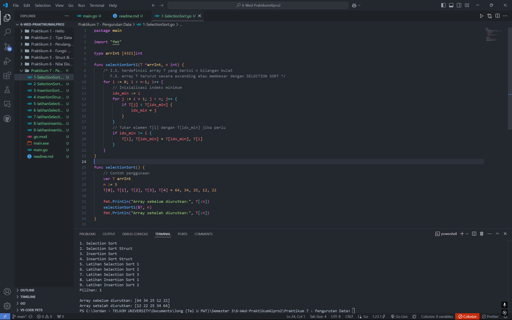
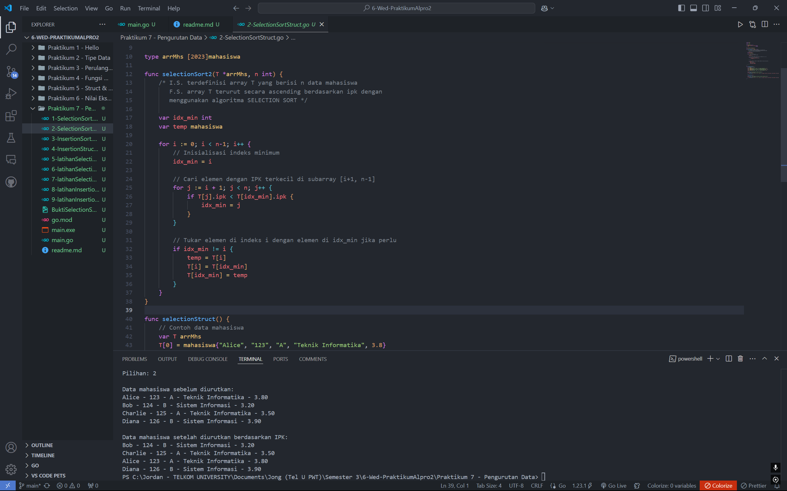
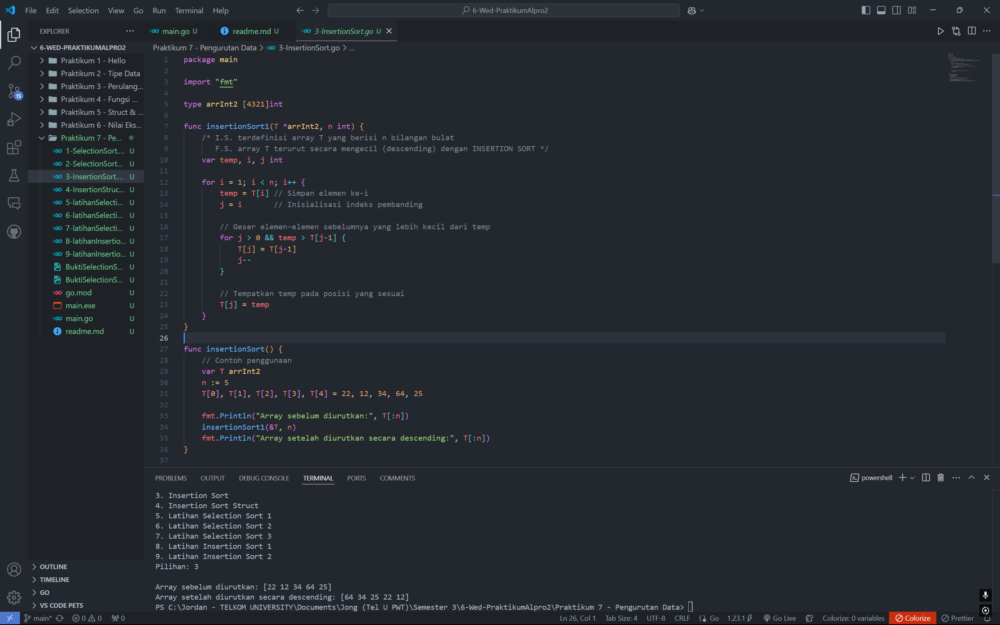
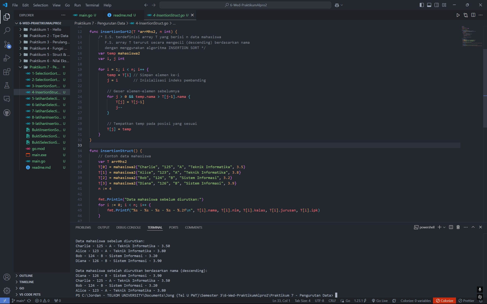
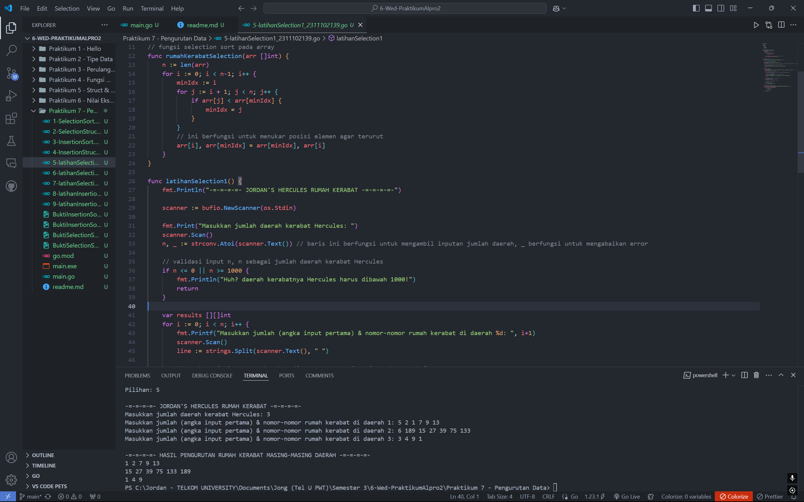
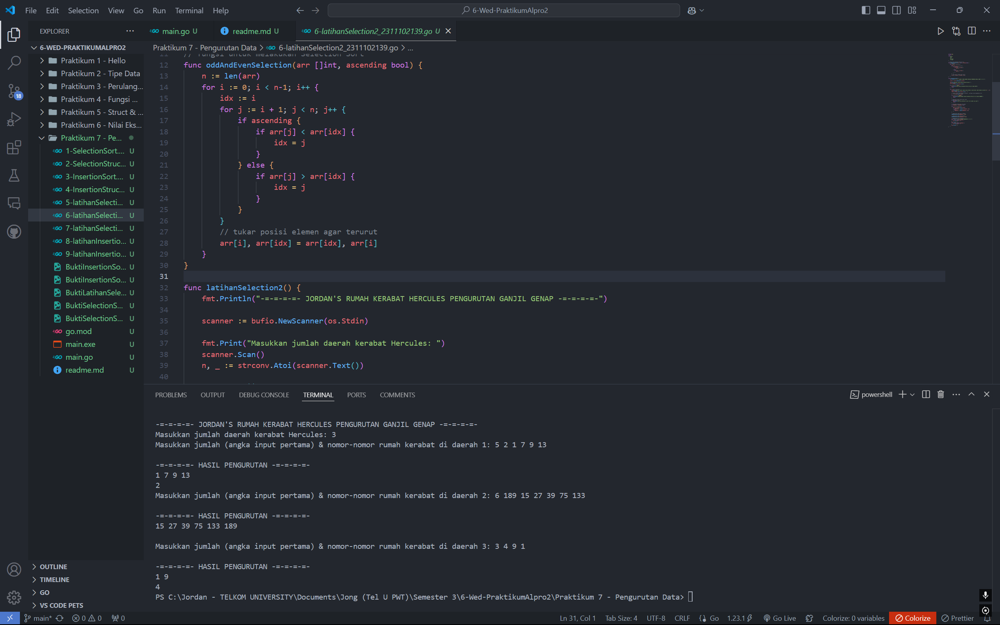
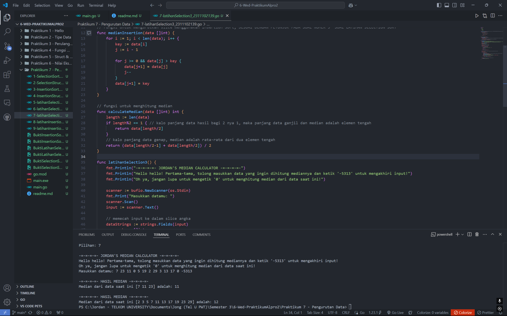
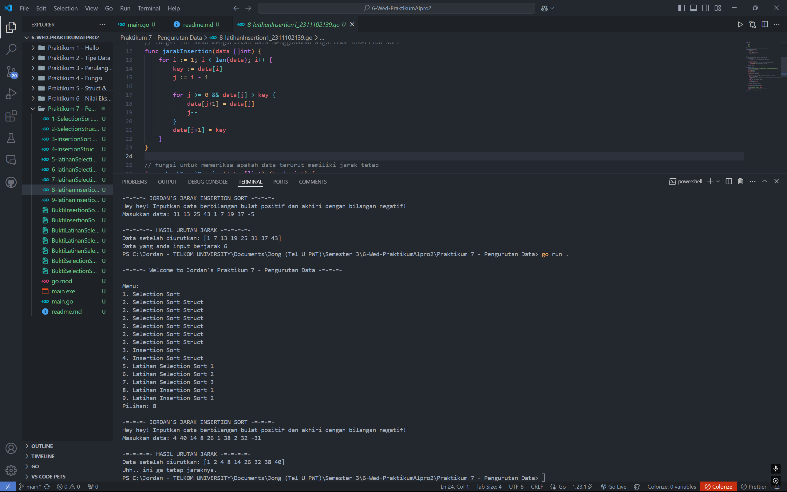
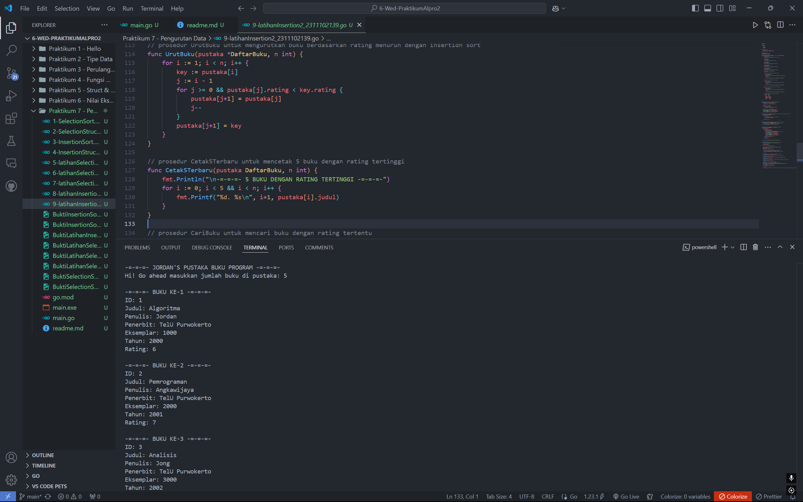
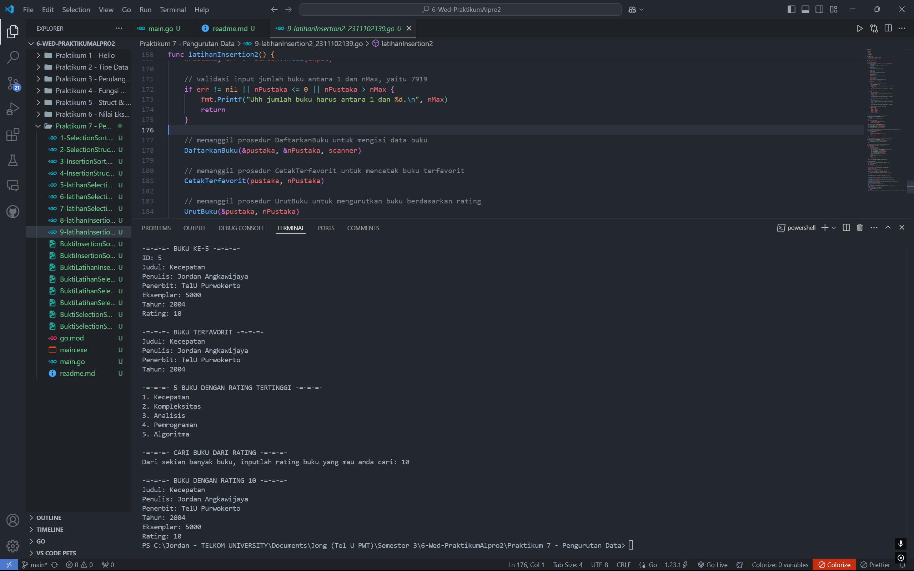

# <h1 align="center">Praktikum 7 Go - Modul 12 & 13 Pengurutan Data</h1>
<p align="center">Jordan Angkawijaya - 2311102139</p>

## 1. Contoh Program Selection Sort
```go
package main

import "fmt"

type arrInt [4321]int

func selectionSort1(T *arrInt, n int) {
	/* I.S. terdefinisi array T yang berisi n bilangan bulat
	   F.S. array T terurut secara ascending atau membesar dengan SELECTION SORT */
	for i := 0; i < n-1; i++ {
		// Inisialisasi indeks minimum
		idx_min := i
		for j := i + 1; j < n; j++ {
			if T[j] < T[idx_min] {
				idx_min = j
			}
		}
		// Tukar elemen T[i] dengan T[idx_min] jika perlu
		if idx_min != i {
			T[i], T[idx_min] = T[idx_min], T[i]
		}
	}
}

func selectionSort() {
	// Contoh penggunaan
	var T arrInt
	n := 5
	T[0], T[1], T[2], T[3], T[4] = 64, 34, 25, 12, 22

	fmt.Println("Array sebelum diurutkan:", T[:n])
	selectionSort1(&T, n)
	fmt.Println("Array setelah diurutkan:", T[:n])
}
```
### Screenshot Output


## 2. Contoh Program Selection Sort Struct
```go
package main

import "fmt"

type mahasiswa struct {
	nama, nim, kelas, jurusan string
	ipk                       float64
}

type arrMhs [2023]mahasiswa

func selectionSort2(T *arrMhs, n int) {
	/* I.S. terdefinisi array T yang berisi n data mahasiswa
	   F.S. array T terurut secara ascending berdasarkan ipk dengan
	   menggunakan algoritma SELECTION SORT */

	var idx_min int
	var temp mahasiswa

	for i := 0; i < n-1; i++ {
		// Inisialisasi indeks minimum
		idx_min = i

		// Cari elemen dengan IPK terkecil di subarray [i+1, n-1]
		for j := i + 1; j < n; j++ {
			if T[j].ipk < T[idx_min].ipk {
				idx_min = j
			}
		}

		// Tukar elemen di indeks i dengan elemen di idx_min jika perlu
		if idx_min != i {
			temp = T[i]
			T[i] = T[idx_min]
			T[idx_min] = temp
		}
	}
}

func selectionStruct() {
	// Contoh data mahasiswa
	var T arrMhs
	T[0] = mahasiswa{"Alice", "123", "A", "Teknik Informatika", 3.8}
	T[1] = mahasiswa{"Bob", "124", "B", "Sistem Informasi", 3.2}
	T[2] = mahasiswa{"Charlie", "125", "A", "Teknik Informatika", 3.5}
	T[3] = mahasiswa{"Diana", "126", "B", "Sistem Informasi", 3.9}
	n := 4

	fmt.Println("Data mahasiswa sebelum diurutkan:")
	for i := 0; i < n; i++ {
		fmt.Printf("%s - %s - %s - %s - %.2f\n", T[i].nama, T[i].nim, T[i].kelas, T[i].jurusan, T[i].ipk)
	}

	selectionSort2(&T, n)

	fmt.Println("\nData mahasiswa setelah diurutkan berdasarkan IPK:")
	for i := 0; i < n; i++ {
		fmt.Printf("%s - %s - %s - %s - %.2f\n", T[i].nama, T[i].nim, T[i].kelas, T[i].jurusan, T[i].ipk)
	}
}
```
### Screenshot Output


## 3. Contoh Program Insertion Sort
```go
package main

import "fmt"

type arrInt2 [4321]int

func insertionSort1(T *arrInt2, n int) {
	/* I.S. terdefinisi array T yang berisi n bilangan bulat
	   F.S. array T terurut secara mengecil (descending) dengan INSERTION SORT */
	var temp, i, j int

	for i = 1; i < n; i++ {
		temp = T[i] // Simpan elemen ke-i
		j = i       // Inisialisasi indeks pembanding

		// Geser elemen-elemen sebelumnya yang lebih kecil dari temp
		for j > 0 && temp > T[j-1] {
			T[j] = T[j-1]
			j--
		}

		// Tempatkan temp pada posisi yang sesuai
		T[j] = temp
	}
}

func insertionSort() {
	// Contoh penggunaan
	var T arrInt2
	n := 5
	T[0], T[1], T[2], T[3], T[4] = 22, 12, 34, 64, 25

	fmt.Println("Array sebelum diurutkan:", T[:n])
	insertionSort1(&T, n)
	fmt.Println("Array setelah diurutkan secara descending:", T[:n])
}
```
### Screenshot Output


## 4. Contoh Program Insertion Sort Struct
```go
package main

import "fmt"

type mahasiswa2 struct {
	nama, nim, kelas, jurusan string
	ipk                       float64
}

type arrMhs2 [2023]mahasiswa2

func insertionSort2(T *arrMhs2, n int) {
	/* I.S. terdefinisi array T yang berisi n data mahasiswa
	   F.S. array T terurut secara mengecil (descending) berdasarkan nama
	   dengan menggunakan algoritma INSERTION SORT */
	var temp mahasiswa2
	var i, j int

	for i = 1; i < n; i++ {
		temp = T[i] // Simpan elemen ke-i
		j = i       // Inisialisasi indeks pembanding

		// Geser elemen-elemen sebelumnya
		for j > 0 && temp.nama > T[j-1].nama {
			T[j] = T[j-1]
			j--
		}

		// Tempatkan temp pada posisi yang sesuai
		T[j] = temp
	}
}

func insertionStruct() {
	// Contoh data mahasiswa
	var T arrMhs2
	T[0] = mahasiswa2{"Charlie", "125", "A", "Teknik Informatika", 3.5}
	T[1] = mahasiswa2{"Alice", "123", "A", "Teknik Informatika", 3.8}
	T[2] = mahasiswa2{"Bob", "124", "B", "Sistem Informasi", 3.2}
	T[3] = mahasiswa2{"Diana", "126", "B", "Sistem Informasi", 3.9}
	n := 4

	fmt.Println("Data mahasiswa sebelum diurutkan:")
	for i := 0; i < n; i++ {
		fmt.Printf("%s - %s - %s - %s - %.2f\n", T[i].nama, T[i].nim, T[i].kelas, T[i].jurusan, T[i].ipk)
	}

	insertionSort2(&T, n)

	fmt.Println("\nData mahasiswa setelah diurutkan berdasarkan nama (descending):")
	for i := 0; i < n; i++ {
		fmt.Printf("%s - %s - %s - %s - %.2f\n", T[i].nama, T[i].nim, T[i].kelas, T[i].jurusan, T[i].ipk)
	}
}
```
### Screenshot Output


## 5. Program Code Latihan Selection Sort 1 - Rumah Kerabat Hercules
```go
package main

import (
	"bufio"
	"fmt"
	"os"
	"strconv"
	"strings"
)

// fungsi selection sort pada array
func rumahKerabatSelection(arr []int) {
	n := len(arr)
	for i := 0; i < n-1; i++ {
		minIdx := i
		for j := i + 1; j < n; j++ {
			if arr[j] < arr[minIdx] {
				minIdx = j
			}
		}
		// ini berfungsi untuk menukar posisi elemen agar terurut
		arr[i], arr[minIdx] = arr[minIdx], arr[i]
	}
}

func latihanSelection1() {
	fmt.Println("-=-=-=-=- JORDAN'S HERCULES RUMAH KERABAT -=-=-=-=-")

	scanner := bufio.NewScanner(os.Stdin)

	fmt.Print("Masukkan jumlah daerah kerabat Hercules: ")
	scanner.Scan()
	n, _ := strconv.Atoi(scanner.Text()) // baris ini berfungsi untuk mengambil inputan jumlah daerah, _ berfungsi untuk mengabaikan error

	// validasi input n, n sebagai jumlah daerah kerabat Hercules
	if n <= 0 || n >= 1000 {
		fmt.Println("Huh? daerah kerabatnya Hercules harus dibawah 1000!")
		return
	}

	var results [][]int
	for i := 0; i < n; i++ {
		fmt.Printf("Masukkan jumlah (angka input pertama) & nomor-nomor rumah kerabat di daerah %d: ", i+1)
		scanner.Scan()
		line := strings.Split(scanner.Text(), " ")

		// membaca jumlah rumah kerabat di daerah, _ berfungsi untuk mengabaikan error
		m, _ := strconv.Atoi(line[0])

		// validasi input m, m sebagai jumlah rumah kerabat di daerah
		if m <= 0 || m >= 1000000 {
			fmt.Println("Banyak banget? rumah kerabatnya Hercules itu dibawah 1000000!")
			return
		}

		// konversi nomor rumah dari string ke integer
		rumah := make([]int, m)
		for j := 0; j < m; j++ {
			rumah[j], _ = strconv.Atoi(line[j+1])
		}

		rumahKerabatSelection(rumah)

		// save hasil pengurutan
		results = append(results, rumah)
	}

	// menampilkan hasil pengurutan
	fmt.Println("\n-=-=-=-=- HASIL PENGURUTAN RUMAH KERABAT MASING-MASING DAERAH -=-=-=-=-")
	for _, sortedRumah := range results {
		for i, nomor := range sortedRumah {
			if i > 0 {
				fmt.Print(" ")
			}
			fmt.Print(nomor)
		}
		fmt.Println()
	}
}
```
### Screenshot Output


## 6. Program Code Latihan Selection Sort 2 - Kerabat Dekat Hercules (Ganjil Genap)
```go
package main

import (
	"bufio"
	"fmt"
	"os"
	"strconv"
	"strings"
)

// fungsi untuk melakukan Selection Sort
func oddAndEvenSelection(arr []int, ascending bool) {
	n := len(arr)
	for i := 0; i < n-1; i++ {
		idx := i
		for j := i + 1; j < n; j++ {
			if ascending {
				if arr[j] < arr[idx] {
					idx = j
				}
			} else {
				if arr[j] > arr[idx] {
					idx = j
				}
			}
		}
		// tukar posisi elemen agar terurut
		arr[i], arr[idx] = arr[idx], arr[i]
	}
}

func latihanSelection2() {
	fmt.Println("-=-=-=-=- JORDAN'S RUMAH KERABAT HERCULES PENGURUTAN GANJIL GENAP -=-=-=-=-")

	scanner := bufio.NewScanner(os.Stdin)

	fmt.Print("Masukkan jumlah daerah kerabat Hercules: ")
	scanner.Scan()
	n, _ := strconv.Atoi(scanner.Text())

	if n <= 0 || n >= 1000 {
		fmt.Println("Huh? Daerah kerabatnya Hercules harus di bawah 1000!")
		return
	}

	for i := 0; i < n; i++ {
		fmt.Printf("Masukkan jumlah (angka input pertama) & nomor-nomor rumah kerabat di daerah %d: ", i+1)
		scanner.Scan()
		line := strings.Split(scanner.Text(), " ")

		// membaca jumlah rumah kerabat di daerah, _ berfungsi untuk mengabaikan error
		m, _ := strconv.Atoi(line[0])

		if m <= 0 || m >= 1000000 {
			fmt.Println("Banyak banget? Rumah kerabatnya Hercules itu di bawah 1000000!")
			return
		}

		// memastikan jumlah rumah sesuai input
		if len(line)-1 != m {
			fmt.Println("Huh? Pay attention to your first number you input!")
			return
		}

		// memisahkan angka ganjil dan genap
		var oddNumbers, evenNumbers []int

		for j := 1; j <= m; j++ {
			num, _ := strconv.Atoi(line[j])
			if num%2 == 0 {
				evenNumbers = append(evenNumbers, num)
			} else {
				oddNumbers = append(oddNumbers, num)
			}
		}

		// mengurutkan angka ganjil membesar
		oddAndEvenSelection(oddNumbers, true)

		// mengurutkan angka genap mengecil
		oddAndEvenSelection(evenNumbers, false)

		// menampilkan hasil pengurutan
		fmt.Println("\n-=-=-=-=- HASIL PENGURUTAN -=-=-=-=-")
		for _, num := range oddNumbers {
			fmt.Print(num, " ")
		}
		fmt.Println(" ")
		for _, num := range evenNumbers {
			fmt.Print(num, " ")
		}
		fmt.Println(" ")
	}
}
```
### Screenshot Output


## 7. Program Code Latihan Selection Sort 3 - Kompetisi Pemrograman Median
```go
package main

import (
	"bufio"
	"fmt"
	"os"
	"strconv"
	"strings"
)

// Fungsi untuk mengurutkan slice menggunakan Insertion Sort, SESUAI DENGAN PETUNJUK PADA SOAL NOMER 3 "SOAL LATIHAN SELECTION SORT"
func medianInsertion(data []int) {
	for i := 1; i < len(data); i++ {
		key := data[i]
		j := i - 1

		for j >= 0 && data[j] > key {
			data[j+1] = data[j]
			j--
		}
		data[j+1] = key
	}
}

// fungsi untuk menghitung median
func calculateMedian(data []int) int {
	length := len(data)
	if length%2 == 1 { // kalo panjang data hasil bagi 2 nya 1, maka panjang data ganjil dan median adalah elemen tengah
		return data[length/2]
	}
	// kalo panjang data genap, median adalah rata-rata dari dua elemen tengah
	return (data[length/2-1] + data[length/2]) / 2
}

func latihanSelection3() {
	fmt.Println("-=-=-=-=- JORDAN'S MEDIAN CALCULATOR -=-=-=-=-")
	fmt.Println("Hello hello! Pertama-tama, tolong masukkan data yang ingin dihitung mediannya dan ketik '-5313' untuk mengakhiri input!")
	fmt.Println("Oh ya, jangan lupa untuk mengetik '0' untuk menghitung median dari data saat ini!")

	scanner := bufio.NewScanner(os.Stdin)
	fmt.Print("Masukkan datamu: ")
	scanner.Scan()
	input := scanner.Text()

	// memecah input ke dalam slice angka
	dataStrings := strings.Fields(input)
	var numbers []int

	for _, str := range dataStrings {
		num, err := strconv.Atoi(str)
		if err != nil {
			fmt.Println("Huh, there's an error..", err)
			return
		}
		if num == -5313 {
			break
		}
		numbers = append(numbers, num)
	}

	var currentData []int // fungsi ini menyimpan data yang diinputkan kecuali angka 0
	zeroFound := false

	for _, num := range numbers {
		if num == 0 {
			zeroFound = true
			// fungsi ini menghitung median dari currentData, tepatnya dari angka 0 terakhir yang diinputkan
			medianInsertion(currentData)
			median := calculateMedian(currentData)
			fmt.Println("\n-=-=-=-=- HASIL MEDIAN -=-=-=-=-")
			fmt.Printf("Median dari data saat ini %v adalah: %d\n", currentData, median)
		} else {
			// menambahkan angka ke currentData kalo bukan 0
			currentData = append(currentData, num)
		}
	}

	// kalo tidak ada angka 0 dalam input, tampilkan pesan error
	if !zeroFound {
		fmt.Println("Lupa ngetik 0 ya?")
	}
}
```
### Screenshot Output


## 8. Program Code Latihan Insertion Sort 1 - Integer Berjarak
```go
package main

import (
	"bufio"
	"fmt"
	"os"
	"strconv"
	"strings"
)

// fungsi ini akan mengurutkan data menggunakan algoritma Insertion Sort
func jarakInsertion(data []int) {
	for i := 1; i < len(data); i++ {
		key := data[i]
		j := i - 1

		for j >= 0 && data[j] > key {
			data[j+1] = data[j]
			j--
		}
		data[j+1] = key
	}
}

// fungsi untuk memeriksa apakah data terurut memiliki jarak tetap
func checkEqualSpacing(data []int) (bool, int) {
	if len(data) < 2 {
		// kalo elemen kurang dari 2, tidak ada jarak yang dapat diperiksa
		return true, 0
	}

	distance := data[1] - data[0]
	for i := 2; i < len(data); i++ { // untuk setiap elemen data ke-i yang dimulai dari 2
		if data[i]-data[i-1] != distance { // kalo jarak antara elemen ke-i dan ke-(i-1) tidak sama dengan jarak sebelumnya
			return false, 0 // maka data tidak memiliki jarak tetap
		}
	}
	return true, distance
}

func latihanInsertion1() {
	fmt.Println("-=-=-=- JORDAN'S JARAK INSERTION SORT -=-=-=-")
	fmt.Println("Hey hey! Inputkan data berbilangan bulat positif dan akhiri dengan bilangan negatif!")

	scanner := bufio.NewScanner(os.Stdin)
	fmt.Print("Masukkan data: ")
	scanner.Scan()
	input := scanner.Text()

	// memecah input ke dalam slice angka
	dataStrings := strings.Fields(input)
	var numbers []int

	// untuk setiap string dalam dataStrings, konversi ke int dan tambahkan ke slice numbers
	for _, str := range dataStrings {
		num, err := strconv.Atoi(str)
		if err != nil {
			fmt.Println("Hmm, there's a problem.. here: ", err) // tampilkan pesan error kalo input tidak valid
			return
		}
		if num < 0 { // kalo input negatif, berhenti
			break
		}
		numbers = append(numbers, num)
	}

	// urutkan data menggunakan Insertion Sort
	jarakInsertion(numbers)

	// periksa apakah data terurut memiliki jarak tetap
	isEqual, distance := checkEqualSpacing(numbers)

	fmt.Println("\n-=-=-=-=- HASIL URUTAN JARAK -=-=-=-=-")
	fmt.Println("Data setelah diurutkan:", numbers)
	if isEqual {
		fmt.Printf("Data yang anda input berjarak %d\n", distance)
	} else {
		fmt.Println("Uhh.. ini ga tetap jaraknya.")
	}
}
```
### Screenshot Output


## 9. Program Code Latihan Insertion Sort 2 - Pustaka Perpustakaan Buku
```go
package main

import (
	"bufio"
	"fmt"
	"os"
	"strconv"
	"strings"
)

type Buku struct {
	id, judul, penulis, penerbit string
	eksemplar, tahun, rating     int
}

const nMax = 7919
type DaftarBuku [nMax]Buku

// Prosedur DaftarkanBuku
func DaftarkanBuku(pustaka *DaftarBuku, n *int, scanner *bufio.Scanner) {
	for i := 0; i < *n; i++ {
		fmt.Printf("\n")
		fmt.Printf("-=-=-=- BUKU KE-%d -=-=-=-\n", i+1)

		// input id
		fmt.Print("ID: ")
		scanner.Scan()
		id := strings.TrimSpace(scanner.Text())

		// input judul
		fmt.Print("Judul: ")
		scanner.Scan()
		judul := strings.TrimSpace(scanner.Text())

		// input penulis
		fmt.Print("Penulis: ")
		scanner.Scan()
		penulis := strings.TrimSpace(scanner.Text())

		// input penerbit
		fmt.Print("Penerbit: ")
		scanner.Scan()
		penerbit := strings.TrimSpace(scanner.Text())

		var eksemplar, tahun, rating int
		var err error

		// untuk eksemplar, validasi input harus angka
		for {
			fmt.Print("Eksemplar: ")
			scanner.Scan()
			eksemplar, err = strconv.Atoi(strings.TrimSpace(scanner.Text()))
			if err == nil {
				break
			}
			fmt.Println("Kamu barusan input non-angka ya? Do it AGAIN.")
		}

		// untuk tahun, validasi input harus angka
		for {
			fmt.Print("Tahun: ")
			scanner.Scan()
			tahun, err = strconv.Atoi(strings.TrimSpace(scanner.Text()))
			if err == nil {
				break
			}
			fmt.Println("Kamu barusan input non-angka ya? Do it AGAIN.")
		}

		// untuk setiap rating, validasi input harus angka
		for {
			fmt.Print("Rating: ")
			scanner.Scan()
			rating, err = strconv.Atoi(strings.TrimSpace(scanner.Text()))
			if err == nil {
				break
			}
			fmt.Println("Kamu barusan input non-angka ya? Do it AGAIN.")
		}

		// memasukkan data buku ke dalam array pustaka
		pustaka[i] = Buku{
			id:       id,
			judul:    judul,
			penulis:  penulis,
			penerbit: penerbit,
			eksemplar: eksemplar,
			tahun:     tahun,
			rating:    rating,
		}
	}
}

// prosedur CetakTerfavorit untuk mencetak buku terfavorit
func CetakTerfavorit(pustaka DaftarBuku, n int) {
	if n == 0 {
		fmt.Println("?? Pustakanya kosong??")
		return
	}
	terfavorit := pustaka[0]
	for i := 1; i < n; i++ {
		if pustaka[i].rating > terfavorit.rating {
			terfavorit = pustaka[i]
		}
	}
	fmt.Println("\n-=-=-=- BUKU TERFAVORIT -=-=-=-")
	fmt.Printf("Judul: %s\n", terfavorit.judul)
	fmt.Printf("Penulis: %s\n", terfavorit.penulis)
	fmt.Printf("Penerbit: %s\n", terfavorit.penerbit)
	fmt.Printf("Tahun: %d\n", terfavorit.tahun)
}

// prosedur UrutBuku untuk mengurutkan buku berdasarkan rating menurun dengan insertion sort
func UrutBuku(pustaka *DaftarBuku, n int) {
	for i := 1; i < n; i++ {
		key := pustaka[i]
		j := i - 1
		for j >= 0 && pustaka[j].rating < key.rating {
			pustaka[j+1] = pustaka[j]
			j--
		}
		pustaka[j+1] = key 
	}
}

// prosedur Cetak5Terbaru untuk mencetak 5 buku dengan rating tertinggi
func Cetak5Terbaru(pustaka DaftarBuku, n int) {
	fmt.Println("\n-=-=-=- 5 BUKU DENGAN RATING TERTINGGI -=-=-=-")
	for i := 0; i < 5 && i < n; i++ {
		fmt.Printf("%d. %s\n", i+1, pustaka[i].judul)
	}
}

// prosedur CariBuku untuk mencari buku dengan rating tertentu
func CariBuku(pustaka DaftarBuku, n int, r int) {
	low, high := 0, n-1
	for low <= high {
		mid := (low + high) / 2
		if pustaka[mid].rating == r {
			buku := pustaka[mid]
			fmt.Printf("\n-=-=-=- BUKU DENGAN RATING %d -=-=-=-\n", r)
			fmt.Printf("Judul: %s\n", buku.judul)
			fmt.Printf("Penulis: %s\n", buku.penulis)
			fmt.Printf("Penerbit: %s\n", buku.penerbit)
			fmt.Printf("Tahun: %d\n", buku.tahun)
			fmt.Printf("Eksemplar: %d\n", buku.eksemplar)
			fmt.Printf("Rating: %d\n", buku.rating)
			return
		} else if pustaka[mid].rating < r {
			high = mid - 1
		} else {
			low = mid + 1
		}
	}
	fmt.Println("Tidak ada buku dengan rating seperti itu.")
}

func latihanInsertion2() {
	fmt.Println("-=-=-=- JORDAN'S PUSTAKA BUKU PROGRAM -=-=-=-")

	var pustaka DaftarBuku
	var nPustaka int

	scanner := bufio.NewScanner(os.Stdin)

	fmt.Print("Hi! Go ahead masukkan jumlah buku di pustaka: ")
	scanner.Scan()
	input := scanner.Text()
	nPustaka, err := strconv.Atoi(input)

	// validasi input jumlah buku antara 1 dan nMax, yaitu 7919
	if err != nil || nPustaka <= 0 || nPustaka > nMax {
		fmt.Printf("Uhh jumlah buku harus antara 1 dan %d.\n", nMax)
		return
	}

	// memanggil prosedur DaftarkanBuku untuk mengisi data buku
	DaftarkanBuku(&pustaka, &nPustaka, scanner)

	// memanggil prosedur CetakTerfavorit untuk mencetak buku terfavorit
	CetakTerfavorit(pustaka, nPustaka)

	// memanggil prosedur UrutBuku untuk mengurutkan buku berdasarkan rating
	UrutBuku(&pustaka, nPustaka)

	// memanggil prosedur Cetak5Terbaru untuk mencetak 5 buku dengan rating tertinggi
	Cetak5Terbaru(pustaka, nPustaka)

	// mencari buku dengan rating yang diinput
	var r int
	fmt.Println("\n-=-=-=- CARI BUKU DARI RATING -=-=-=-")
	fmt.Print("Dari sekian banyak buku, inputlah rating buku yang mau anda cari: ")
	scanner.Scan()
	r, err = strconv.Atoi(scanner.Text())
	if err != nil {
		fmt.Println("?? It ain't there.")
		return
	}
	CariBuku(pustaka, nPustaka, r) // memanggil prosedur CariBuku untuk mencari buku dengan rating yang diinput
}
```
### Screenshot Output



